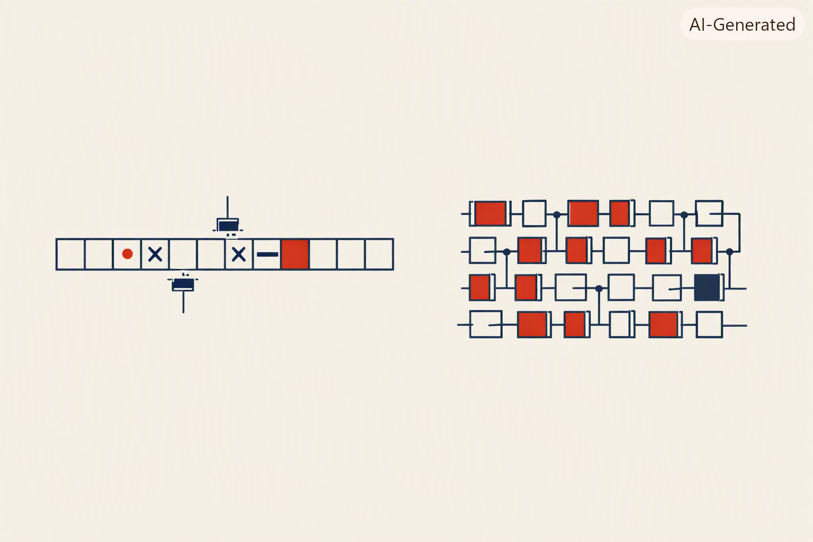

<p align="center">
  
</p>

<p align="center">
  
</p>

*Papierband + Symbole = Turings Beweiswerkzeug ◆ Relais-Matrix + Verdrahtung = Zuses Rechenwerk ◆ beide gleich mächtig ◆ dieses Buch folgt der rechten Seite.*

──────────◆──────────◆──────────◆──────────◆──────────

## 🎯 Warum dieses Kapitel vor der CPU steht

Bevor wir in `01_CPU` einen Prozessor bauen, lohnt sich eine kurze,
ehrliche Standortbestimmung: Es gibt zwei sehr unterschiedliche
Traditionen, aus denen die moderne Informatik hervorgegangen ist — eine
theoretische und eine ingenieurgetriebene. Dieses Buch folgt bewusst der
zweiten. Dieses Kapitel erklärt, warum, und benennt damit einen Grundsatz,
der sich durch die gesamte Reihe zieht.

## 📜 Historischer Kontext: Eine Krise, zwei unabhängige Antworten

1931 zeigte **Kurt Gödel** mit seinen Unvollständigkeitssätzen, dass kein
formales System zugleich vollständig und widerspruchsfrei sein kann — eine
mathematische Erschütterung, die David Hilberts Programm, alle Mathematik
auf ein sicheres, vollständiges Fundament zu stellen, im Kern traf. Daraus
entstand Hilberts *Entscheidungsproblem*: Gibt es wenigstens einen
Algorithmus, der für jede mathematische Aussage entscheidet, ob sie
beweisbar ist?

**Alan Turing** beantwortete diese Frage 1936 mit "Nein" — und erfand dafür
ein gedankliches Werkzeug: eine Maschine, die ein unendlich langes Band
liest, beschreibt und sich nach einer Zustandstabelle bewegt. Die
Turing-Maschine wurde nie gebaut, um zu rechnen. Sie wurde konstruiert, um
etwas über die *Grenzen* des Berechenbaren zu beweisen — ein Beweiswerkzeug
der Mathematik, kein Bauplan für einen Rechner. Fast zeitgleich kam
**Alonzo Church** über einen völlig anderen formalen Weg (den
Lambda-Kalkül) zum selben Ergebnis — die Church-Turing-These hält bis heute:
beide Formalismen sind gleich mächtig, und nichts, was wir seither gebaut
haben, ist mächtiger.

Fast zeitgleich, aber **völlig unabhängig und ohne jede Kenntnis dieser
Arbeiten**, saß in Berlin ein Bauingenieur namens **Konrad Zuse** vor
lästigen, sich wiederholenden statischen Berechnungen. Zuse fragte nicht
"was ist theoretisch berechenbar?" — er fragte "wie werde ich diese
Rechnerei los?" Zwischen 1935 und 1941 baute er, zunächst in der
Wohnung seiner Eltern, mit ausrangierten Blechstreifen und ohne
akademisches Umfeld, den Z3 — den ersten funktionsfähigen, frei
programmierbaren, binären Rechner der Welt. Kein Beweis, keine Theorie.
Nur: probieren, bauen, verbessern, bis es funktioniert.

## 🧭 Der rote Faden dieses Buches

Das ist die eigentliche Pointe dieses Kapitels, und sie ist mehr als eine
historische Randnotiz: **Dieses Buch folgt konsequent dem Zuse-Weg, nicht
dem Turing-Weg.** Nicht, weil die theoretische Informatik unwichtig wäre —
sondern weil die Reihe eine These vertritt, die sich durch alle drei Teile
zieht:

> Der belastbarste Erkenntnisgewinn in der Informatik — und ganz besonders
> in der Künstlichen Intelligenz — entsteht durch **Experiment und
> Iteration**, nicht durch reine Ableitung am Reißbrett.

Das ist keine Handbewegung, sondern eine Beobachtung, die sich durch die
gesamte Reihe bestätigt: In Teil 2 wird sich zeigen, dass niemand
Backpropagation theoretisch vorhergesagt und dann gebaut hat — man hat
beobachtet, dass es funktioniert, lange bevor man vollständig verstand,
*warum*. Und in Teil 3, beim Kapitel zu trainiertem Reasoning, wird sich
dieselbe Methode noch einmal zeigen — diesmal nicht bei der Hardware,
sondern beim Trainingsverfahren selbst: Ein Modell lernt zu "denken", weil
man es ausprobiert und beobachtet hat, nicht weil man es theoretisch
hergeleitet hätte. Von Zuses Blechstreifen 1941 bis zu selbstentdecktem
Reasoning-Verhalten 2025 liegt methodisch derselbe Grundsatz.

Das bedeutet nicht, dass Theorie unwichtig ist — die Church-Turing-These
bleibt eine der tiefsten Erkenntnisse der Informatik, und wir respektieren
sie, indem wir sie hier ehrlich einordnen, statt sie zu ignorieren. Aber ab
`01_CPU` wählt dieses Buch bewusst den Weg des Bauens vor dem Weg des
Beweisens.

## 🧠 Was du baust

Ein minimaler **Turing-Maschinen-Simulator**, der bewusst *nicht* mit
einem unendlichen Band arbeitet, sondern mit **16 Zellen** — genau der
Speicher-Grössenordnung der 4-Bit-CPU aus Kapitel 01. Und er rechnet
**genau die Aufgabe**, die auch in Kapitel 01 als CPU-Programm auftaucht:

$$
(3 + 4) - 1 = 6
$$

nur in **unärer Kodierung**: `|||` = 3, `||||` = 4, `|` = 1. Das
Startband sieht so aus:

```
Position:   0  1  2  3  4  5  6  7  8  9  10 11 12 13 14 15
Initial:    |  |  |  +  |  |  |  |  -  |  _  _  _  _  _  _
```

Die Zustandstabelle hat sieben Zustände (`ADD_PLUS`, `SUB_MINUS`,
`SUB_DEL_LEFT`, `SUB_ERASE_MINUS`, `SUB_DEL_RIGHT`, `SHIFT_HOME`,
`SHIFT_HOME_MAYBE`) und rund ein Dutzend Übergangsregeln. Der Kopf
wandert über das Band, schreibt Symbole, wechselt Zustände — und nach
**22 Schritten** steht auf dem Band:

```
End:        |  |  |  _  |  |  |  _  _  _  _  _  _  _  _  _
                        (6 Striche = 6)
```

Sechs Striche, wie versprochen. Aber der Weg dorthin ist grotesk
umständlich: für dieselbe Rechnung braucht die CPU aus Kapitel 01
gerade einmal **8 Instruktionen**, weil sie Zahlen als *binäre
Bit-Muster in Registern* darstellt, nicht als Striche auf einem Band.

Das ist die eigentliche Pointe dieses Kapitels: **Turings Modell
funktioniert — es rechnet, was es rechnen soll — aber niemand würde so
einen Rechner bauen.** Und genau deshalb geht es in Kapitel 01 nicht mit
mehr Theorie weiter, sondern mit einer Maschine, die man tatsächlich
bauen könnte.

## 🚀 Schnelleinstieg

```bash
# Auto-Modus (0.35 s Pause pro Schritt, ca. 8 s Gesamt-Laufzeit)
python 01_Computing/00_Fundament/src/program_add_sub.py

# Schrittweise durchklicken (nach jedem Schritt Enter druecken)
python 01_Computing/00_Fundament/src/program_add_sub.py --step

# Schneller Durchlauf ohne Pause
python 01_Computing/00_Fundament/src/program_add_sub.py --fast
```

Die Ausgabe zeigt für jeden Schritt:

- den aktuellen **Zustand**
- die **16 Bandzellen** in einer geschlossenen Box, die aktive Zelle
  farbig hervorgehoben
- die zuletzt angewendete **Übergangsregel** in der Form
  `(Zustand, gelesen) → schreibe X, Kopf →, Zustand Y`

Am Ende steht die Auswertung: `Bandinhalt`, Anzahl der Striche, Anzahl
der Schritte — und das kleine `✓ (3 + 4) - 1 = 6`, das den Beweis
liefert, dass ein Papierband + Zustandstabelle tatsächlich rechnen kann.

*Voraussetzung: Python 3.8+ und ein UTF-8-fähiges Terminal (Windows
Terminal, macOS Terminal, Linux Konsole). Keine externen Abhängigkeiten.*

## 📚 Quellen

- Gödel, K. (1931). *Über formal unentscheidbare Sätze der Principia Mathematica und verwandter Systeme I.*
- Turing, A. (1936). *On Computable Numbers, with an Application to the Entscheidungsproblem.*
- Church, A. (1936). *An Unsolvable Problem of Elementary Number Theory.*
- Zuse, K. (1993). *Der Computer — Mein Lebenswerk.* (Zuses eigene Darstellung von Z1–Z3, 1935–1941)

## ✏️ Übungen

*[Platzhalter]*

## ➡️ Grenzen dieses Kapitels

Die Turing-Maschine sagt uns, was *im Prinzip* berechenbar ist — aber
nichts darüber, wie man tatsächlich eine Maschine baut, die das tut, und
schon gar nichts darüber, wie eine Maschine *lernen* könnte. Kapitel
`01_CPU` beginnt entsprechend nicht mit weiterer Theorie, sondern mit einem
Bus, einer ALU und einem Mikrocode-ROM — dem ersten Schritt auf dem
Zuse-Weg.