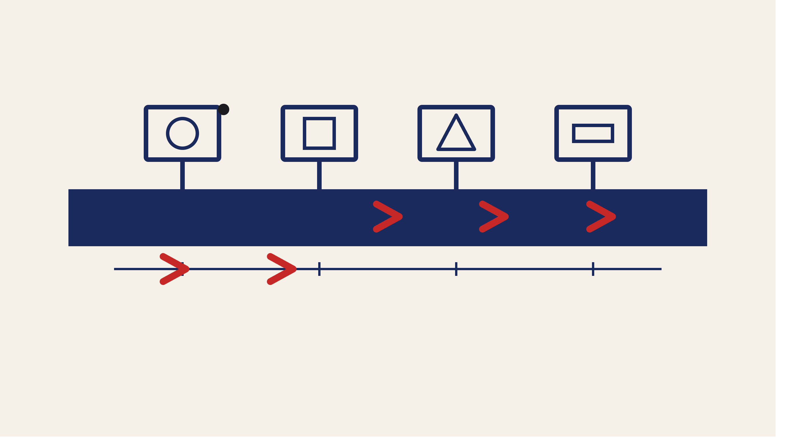

<p align="center">
  
</p>

<p align="center">
  
</p>

*Bus = Autobahn ◆ Register/ALU/PC = Anschlussblöcke ◆ Instruktionen = Fahrzeuge in Kolonne ◆ Takt = Kilometersteine.*

──────────◆──────────◆──────────◆──────────◆──────────

> Eine funktionierende **Rechenmaschine mit 4-Bit-Registern, ALU, RAM, Program Counter, Instruction Register und mikrocode­gesteuerter Control Unit** — alles in einer einzigen, kommentiert-lesbaren Python-Datei. Und darunter eine **radikal minimale Variante**: nur *ein* Register (ACC), eine ALU mit *zwei* Operationen (INC + NOT), und trotzdem **Turing-vollständig**. Alles, was du an einem echten Prozessor je gesehen hast — Pipeline, Cache, Multicore, GPU — ist nur *Skalierung* dieser einen Idee.

---

## 🌉 Der Anfang: Wie kommt aus einem Kabelbaum eine Rechenmaschine?

1945 schreibt **John von Neumann** in seinem *First Draft of a Report on the EDVAC* die Blaupause auf, die bis heute jedem Computer zugrunde liegt: **Programm und Daten in demselben Speicher**, eine **arithmetisch-logische Einheit (ALU)**, ein **Programmzähler (PC)**, ein **Instruktionsregister (IR)** — und ein zentrales Steuerwerk, das aus dem Bit-Muster des aktuellen Befehls eine Folge von *Mikroschritten* macht: hole den Befehl, dekodiere ihn, führe ihn aus.

Zehn Jahre später, 1955, verlegt **Maurice Wilkes** in Cambridge diesen Steuerteil als *Mikrocode* in einen **eigenen kleinen ROM**: die Control Unit ist damit selbst wieder ein winziger Rechner, dessen Programm die *Bedeutung der Befehle* ist. Und noch einmal ein Jahrzehnt später, 1971, packt **Intel** das alles in einen einzigen Chip (den 4004) — mit erstaunlich ähnlicher Architektur wie diese Simulation: **4-Bit-Datenbus, 4-Bit-Register, ein Akkumulator**.

In diesem Meilenstein programmieren wir genau dieses Modell — als **framework­artigen Baukasten**, in dem verschiedene CPU-Varianten wie *Konfigurationen* aussehen: dieselben drei Bus-Schleifen, derselbe Mikrocode-Dekoder, aber jede Variante hat einen anderen Satz an Registern, ALU-Operationen und Befehlen.

So schlicht das Design auch ist — es enthält bereits alle Bausteine, die einen Computer zu einem Computer machen: **Speicher, Rechnen, Kontrollfluss, ein einzelner Bus** und eine **fest verdrahtete Regel, wie aus einem Bit-Muster ein Verhalten wird**.

> **📚 Wer verstehen will, wie die einzelnen Bausteine unterhalb dieser
> Simulation elektronisch zusammenkommen — UND/ODER/NICHT, Halb- und
> Volladdierer, Flip-Flops, Tri-State-Gatter und der Bus als
> Konfliktressource — findet die ausführliche Herleitung im Deep Dive
> [→ Schaltnetze und Schaltwerke](../grundlagen/schaltnetze.md).**
>
> **Und für die formale Definition der Von-Neumann-Architektur (was ein
> Computer als Automat *ist*, wie Fetch und Execute mathematisch
> zusammengehören, wie Mikrocode am 4-Bit-Beispiel Schritt für Schritt
> aussieht):** [→ Die Von-Neumann-Architektur](../grundlagen/von_neumann.md).


## 🕰️ Historischer Kontext

| Jahr | Ereignis | Bedeutung |
|------|----------|-----------|
| **1936** | Alan Turing: *On Computable Numbers* | Definiert die *Universal­maschine* — jede berechenbare Funktion ist mit unbeschränkter Zeit und einem Band voll Symbolen realisierbar |
| **1945** | John von Neumann: *First Draft, EDVAC* | Programm und Daten im selben Speicher; ALU, PC, IR, Control Unit als getrennte Bausteine |
| **1949** | EDSAC (Cambridge) | Erster praktisch funktionierender Computer nach der Von-Neumann-Architektur |
| **1955** | Maurice Wilkes: Mikrocode | Steuerung der ALU/Register durch ein *inneres Programm* im Control-Store — die Idee dieser Simulation |
| **1971** | **Intel 4004** | Der erste kommerzielle Ein-Chip-Prozessor: **4-Bit-CPU, 640 Bytes RAM, 108 kHz** — die direkte Vorlage für dieses Modell |
| **1976** | Wozniak: Apple I | Zeigt, dass ein einzelner Mensch mit 6502 (8-Bit) einen Personal Computer bauen kann |
| **heute** | Milliarden Transistoren, GPUs | Alles nur *Skalierung* derselben Grundidee: Register, ALU, Speicher, Bus, Control Unit |

Der 4-Bit-Prozessor ist damit **kein historisches Kuriosum**, sondern der elementare Baustein, aus dem alle modernen Computer aufgebaut sind — inklusive derjenigen, auf denen die neuronalen Netze aus Teil 2 dieses Projekts trainiert werden.

---

## 🧠 Die Aufgabe: „Rechne (3 + 4) − 1 und zeige das Ergebnis"

Das minimalste Programm für unsere Akku-CPU liest sich fast wie Pseudocode:

```asm
LDI 3        ; ACC ← 3
ADD 4        ; ACC ← ACC + 4      (Operand kommt direkt aus IR)
SUB 1        ; ACC ← ACC − 1  = 6
STA 5        ; RAM[5] ← ACC
LDI 0        ; ACC ← 0
LDA 5        ; ACC ← RAM[5]   (= 6)
OUT          ; OUT-Register ← ACC
HLT
```

Auffällig: es gibt kein Zwischenregister. Der zweite Operand für `ADD`/`SUB` kommt **direkt aus dem Instruction Register** — das enthält nach dem Fetch ohnehin schon den Operanden des aktuellen Befehls. Ein extra `TMP`-Register wäre redundant. Diese Architektur heißt klassisch **Akkumulator-Maschine** (SAP-1, Intel 4004, 8-Bit-Mikros wie 6502/8080).

Auf einer echten CPU braucht das folgende Schritte:

1. **Fetch**: der Program Counter zeigt auf `LDI 3`. Die Control Unit liest den Befehl, füllt das Instruction Register mit der `3` und erhöht den Program Counter.
2. **Execute**: die Control Unit schaltet zwei Gates am Bus — das IR schreibt seine `3` auf den Bus, ACC liest sie ab.
3. Und so weiter — jeder Befehl wird in **kleinere Mikroschritte** zerlegt, jeder Mikroschritt aktiviert nur ein paar wenige Steuerleitungen gleichzeitig.

Unsere Simulation zeigt genau diese Zerlegung — live, mit farbigen Boxen, einem sichtbaren Bus, einem Program Counter, der pro Takt weiterspringt, und einer Mikrocode-Tabelle, in der man den aktuellen Schritt markiert sieht.

**Warum diese Aufgabe?** Sie ist minimal, aber vollständig:

1. **Immediate-Load** (`LDI`, `LDT`) — zeigt, wie eine Konstante aus dem Instruction Register auf den Bus kommt.
2. **ALU-Nutzung** (`ADD`) — zeigt Register→ALU→Register über den Bus.
3. **Speicherzugriff** (`STA`, `LDA`) — zeigt RAM als *echten* Bus-Teilnehmer, nicht nur als Zahlen­feld.
4. **Halt** (`HLT`) — zeigt, wie ein reines *Aktionssignal* (kein Datenfluss) die CPU stoppt.

---

## 🧩 Architektur des Frameworks

Das Framework besteht aus **wiederverwendbaren Bausteinen** und **CPU-Konfigurationen**, die diese Bausteine unterschiedlich zusammensetzen:

```

     ┌──────────────────── einheitliche Bus-Bausteine ────────────────────┐
     │                                                                    │
     │   PC   Register(ACC/TMP/…)   ALU(configurable)   IR   RAM   OUT    │
     │                                                                    │
     └───────────────────────────────┬────────────────────────────────────┘
                                     │  ein 4-Bit Bus, drei Schleifen:
                                     │    1) set_gates   2) write_bus  3) read_bus
                                     ▼
     ┌──────────────────────── ControlUnit ─────────────────────────┐
     │  Step-Counter 0..3, holt pro Takt ein Steuerwort aus dem     │
     │  Mikrocode-ROM (ausser Step 0: FETCH ist fest verdrahtet).   │
     └────────────────────────────┬─────────────────────────────────┘
                                  ▼
     ┌───────────────── Konfiguration ─────────────────┐
     │  welche Elemente, welche ALU-Ops,               │
     │  welcher Mikrocode (Opcode → Steuerwörter)      │
     └─────────────────────────────────────────────────┘

```

Mathematisch lässt sich ein Takt so beschreiben:

$$
\text{signals}_t = \text{decode}\bigl(\text{opcode}_t,\ \text{step}_t\bigr)
$$

$$
\text{bus}_t = \bigvee_{e \in E}\ (e \text{ ist OUT-Treiber in } \text{signals}_t \to \text{value}(e))
$$

$$
\forall e: \text{value}(e)_{t+1} =
\begin{cases}
\text{bus}_t & \text{wenn } e \text{ IN-Empfänger in } \text{signals}_t \\
\text{value}(e)_t & \text{sonst}
\end{cases}
$$

- Der **Bus** ist die zentrale Datenautobahn: pro Takt darf **höchstens ein** Element schreiben (`OUT`), beliebig viele lesen (`IN`).
- Der **Mikrocode-ROM** bildet jeden Opcode auf eine **Liste von 1–4 Steuerwörtern** ab. Ein Steuerwort ist einfach die Menge der Signale, die in diesem Takt aktiv sind (z.B. `{ACC_IN, ALU_OUT, ALU_ADD, END}`).
- **`FETCH`** (Step 0) ist bei allen Befehlen identisch und daher fest verdrahtet, nicht im ROM.

**Größenordnungen der drei mitgelieferten CPUs:**

| Eigenschaft           | *Minimal*     | *Akku (SAP-1)*  | *Two-Reg (AX+BX)*                |
| :-------------------- | :------------ | :-------------- | :------------------------------- |
| Register              | 1 (ACC)       | 1 (ACC)         | 2 (AX + BX)                      |
| Zweiter ALU-Operand   | – (unär)      | IR (Immediate)  | BX (Register)                    |
| ALU-Ops               | 2 (INC, NOT)  | 2 (ADD, SUB)    | 2 (ADD, SUB)                     |
| Opcodes               | 10            | 11              | 14                               |
| Ausdrucks-Modell      | Turing-Kern   | Immediate-Ops   | Register-Register                |
| `(a + b)`, a,b in RAM | Schleife      | via RAM         | direkt (`LDA a; LDBM b; ADD`)    |

**Der springende Punkt:** *acc* und *two-reg* sehen auf den ersten Blick ähnlich aus (beide 1 Zielregister, beide 2 ALU-Ops), sind aber in dem Sinne, was man **elegant ausdrücken kann**, sehr unterschiedlich:

- **acc** kann in einem Befehl nur „Register + Konstante" rechnen. Für „Register + Register" (also `a + b`, beides Variablen) muss man den einen Operanden zwischendurch in RAM ablegen und zurückladen.

---

## ⚙️ Der Ablauf pro Takt (drei Bus-Schleifen)

Jeder Takt besteht aus exakt fünf Schritten:

1. **CU liefert Steuerwort** — die Control Unit fragt ihren Mikrocode-ROM: „was ist der aktuelle Schritt für den aktuellen Opcode?" Das Ergebnis ist eine Menge von Signalen wie `{ACC_OUT, RAM_IN, END}`.
2. **`set_gates`** — jedes Element bekommt sein Gate anhand seines Namens: `ACC` mit dem Signal `ACC_OUT` steht auf **OUT**, `RAM` mit `RAM_IN` steht auf **IN**, alle anderen sind **NONE**.
3. **ALU rechnet** *(vor dem Bus)* — das ist wichtig: die ALU liest die *aktuellen* Register-Werte, nicht den Bus. Sonst würde `ACC += 1` zu `ACC += 2` werden.
4. **`write_bus`** — der eine OUT-Treiber legt seinen Wert auf den Bus. Mehr als ein OUT-Signal ergibt einen **Bus-Konflikt** und die Simulation stoppt mit Fehler — genau wie an echter Hardware, wo das ein Kurzschluss wäre.
5. **`read_bus`** — alle IN-Empfänger übernehmen den Bus-Wert in ihr Register.
6. **Post-Bus-Aktionen** — Program Counter erhöhen (`CE`), CPU anhalten (`HLT`).
7. **Step-Counter weiter** — wenn `END` im Steuerwort war → zurück auf 0 (nächster Befehl), sonst +1 (nächster Mikroschritt).

Das ist alles. Jeder komplexe Prozessor der Welt macht im Kern genau das — nur mit deutlich mehr Registern, breiteren Bussen, mehreren ALUs parallel, Pipeline-Stufen und einem Cache dazwischen.

---

## ▶️ So startest du das Programm

```bash
cd CPU/src
python cpu_sim.py                                    # Akku-CPU + Default-Programm
python cpu_sim.py acc     programs/acc_add.asm
python cpu_sim.py minimal programs/minimal_count.asm
python cpu_sim.py two_reg programs/two_reg_add.asm   # Register-Register-Ops (AX+BX)
```

Das Programm:

1. lädt die gewählte **CPU-Konfiguration** (`acc`, `minimal` oder `two_reg`),
2. lädt das gewünschte **Assembler-Programm** aus einer `.asm`-Datei (oder aus dem eingebauten Default, wenn du keins angibst),
3. rendert das Panel **live im Terminal**: Register, ALU, Bus, Program Counter, RAM, Control Unit und einen kombinierten Decoder + Mikrocode-ROM,
4. läuft Takt für Takt, hebt farbig hervor, wer gerade **sendet** (grün), wer **liest** (cyan) und welcher **Mikroschritt** gerade abgearbeitet wird (magenta).

Voraussetzung: **Python 3.7+**, keine externen Abhängigkeiten. Für die farbigen Boxen ein ANSI-fähiges Terminal (Windows Terminal, PowerShell 7+, alles Unix-ähnliche).

Selbst-Test von der Wurzel `CPU/`:
```bash
python test_configs.py
# → beide CPUs headless laufen lassen, Ergebnisse pruefen
```

---

## 📈 Beispielausgabe (Akku-CPU, `acc_add.asm`)

Nach 16 Takten:

```
╔ PC ════════════╗  ╔ ACC ═══════════╗  ╔ IR ════════════╗  ╔ ALU ═══════════╗  ╔ OUT ═══════════╗
║ 8  0b1000      ║  ║ 6  0b0110      ║  ║ 0  0b0000      ║  ║ 6  0b0110      ║  ║ 6  0b0110      ║
║ program counter║  ║ 4-bit register ║  ║ operand field  ║  ║ ADD  C=0       ║  ║ 4-bit register ║
╚════════════════╝  ╚════════════════╝  ╚════════════════╝  ╚════════════════╝  ╚════════════════╝

═══════════════════════════ BUS ═══════════════════════════

╔ RAM 16x4 ══════════════════════════════╗    ╔ ControlUnit ═══════════════════════════════╗
║     0   1   2   3                      ║    ║ phase=HALT   step=[*][ ][ ][ ]             ║
║ 0:  0   0   0   0                      ║    ║ opcode=HLT   operand=0   carry=0           ║
║ 1:  0   0   0   0                      ║    ║ CE          PC_IN       ACC_IN     ACC_OUT ║
║ 5:  6                                  ║    ║ ALU_OUT     ALU_ADD     ALU_SUB    IR_OUT  ║
╚════════════════════════════════════════╝    ║ RAM_IN      RAM_OUT     OUT_IN     HLT     ║
                                              ║ END                                        ║
                                              ╚════════════════════════════════════════════╝

 ► CPU angehalten. Ergebnis: ACC=6  OUT=6  RAM=[5:6]
```

**Und der Star des Kapitels — die Mikroschritt-Zerlegung:**

Für den Befehl `ADD` liest man in der Decoder-View:

```
ADD   ACC ← ACC + imm   1: { ACC_IN, ALU_ADD, ALU_OUT, END }
```

Das ist *ein einziger* Mikroschritt: das Signal `ALU_ADD` wählt die Addition, die ALU rechnet `ACC + IR` (der zweite Operand ist direkt der Instruktions-Operand), `ALU_OUT` treibt das Ergebnis auf den Bus, `ACC_IN` übernimmt es. Und mit `END` weiß die Control Unit: nächster Befehl. Das ist es. Es gibt keine geheime Ebene darunter.

---

## 🪶 Die Minimal-CPU: nur INC und NOT — und trotzdem alles

Die zweite mitgelieferte Konfiguration ist eine **radikal reduzierte** CPU:

- **ein einziges Register** (ACC),
- **eine ALU mit zwei Operationen**: `INC` (ACC + 1) und `NOT` (bitweises Invertieren),
- **kein zweiter Operand**, kein ADD, kein SUB.

Alles, was man an gewöhnlicher Arithmetik gewohnt ist, muss man daraus **konstruieren**:

- **Addition** von $n$ zu ACC: `n`-mal `INC` in einer Schleife.
- **Negation** (–x) in 2 Takten: `NOT` (→ Einerkomplement) + `INC` (→ Zweierkomplement). In 4-Bit-Arithmetik gilt: `-5 = NOT(5) + 1 = 0xA + 1 = 0xB`.
- **Subtraktion** $a - b$: negiere $b$, dann addiere.
- **Multiplikation**, **Division**, **Modulo**: verschachtelte Schleifen.

Das Beispielprogramm `minimal_count.asm` zählt in einer Schleife von 0 bis 5, indem es einen Loop-Counter (RAM[1]) auf $-5$ initialisiert und pro Durchgang mit `INC` Richtung 0 laufen lässt. Beendet wird die Schleife per `JZ` (jump if zero) — die einzige bedingte Instruktion.

Diese Minimal-CPU ist ausreichend, um **jede berechenbare Funktion** zu implementieren (Church–Turing). Man braucht mehr *Zeit* und mehr *RAM*, aber nichts qualitativ Neues. Genau das ist der Punkt: **alles, was ein moderner Prozessor mehr kann, ist Skalierung** — mehr Register, breitere Datenpfade, mehr ALU-Operationen, Pipeline, Cache, Multicore. Aber keine dieser Erweiterungen fügt eine neue *Klasse* von Berechnung hinzu.

Das ist eine schöne Parallele zum ersten Meilenstein von Teil 2 dieses Projekts:

> **Perceptron → GPT** ist Skalierung *eines* Neurons.
> **Minimal-CPU → moderner Prozessor** ist Skalierung *einer* Rechen-Einheit.

Beide Male: kein Rätsel, keine geheime Schicht — nur *mehr davon*.

---

## ❗ Ehrliche Diskussion: Was zeigt dieses Modell — und was nicht?

**Was es korrekt zeigt:**

- Die **Von-Neumann-Architektur** (Programm und Daten im selben Speicher, ALU, PC, IR, CU).
- Das **Mikroprogramm-Prinzip** (Wilkes 1955): jeder Befehl wird intern in kleinere Steuerworte zerlegt.
- Den **Bus als Konfliktressource**: nur ein Sender pro Takt, sonst Kurzschluss.
- Die **Trennung zwischen Fetch und Execute** — jeder Befehl braucht ≥2 Takte.
- Die **Turing-Vollständigkeit** kleinster Befehlsätze (Minimal-CPU).

**Was es bewusst *nicht* zeigt:**

- **Pipelining** — alle Takte sind hier sequenziell. Echte CPUs überlappen Fetch/Decode/Execute mehrerer Befehle.
- **Cache-Hierarchien** — hier gibt es nur einen einstufigen RAM.
- **Interrupts** — es gibt kein Konzept „hier passiert etwas außerhalb der CPU, unterbrich den aktuellen Ablauf". Deshalb bleibt in unserem Modell **echtes Multitasking und I/O** unerreichbar.
- **Virtueller Speicher** — MMU, Seiten­tabellen, Schutz zwischen Prozessen. Wieder eine Skalierungs­frage.
- **Zeitverhalten** — jeder Takt ist ein `time.sleep()`, nicht ein Nanosekunden-Takt.
- **Compiler und Betriebssystem** — folgen im nächsten Ausbau (siehe Ausblick).

Anders gesagt: diese Simulation zeigt **die Idee**, nicht die technische Perfektion. Und genau das macht sie didaktisch nützlich — man sieht *worauf es ankommt*, nicht *warum ein Intel Core i9 komplizierter ist*.

---

## 📝 Übungen

**1. Akku-Programm schreiben.** Rechne $(6 + 3) - 2$ auf der `acc`-CPU. Wie viele Takte brauchst du? *(Erwartung: 5 Instruktionen × 2 Takte = 10 Takte, plus Loads.)*

**2. Minimal-CPU: Subtraktion.** Berechne $7 - 3$ auf der Minimal-CPU. Tipp: erst `NOT` + `INC` für $-3$, dann in einer Schleife 3-mal `INC` auf $7$. Wie viele Takte sind das?

**3. Neue ALU-Operation hinzufügen.** Erweitere `config_acc.py` um `XOR` (bitweises XOR von ACC und IR). Das geht in genau 3 Zeilen: neuen `ALUOp("XOR", …)` in `_build_alu`, `XOR`-Opcode im MICROCODE-Dict und ein Eintrag in `OPCODE_INFO`. Baue anschließend ein Testprogramm, das mit `XOR` zwei Werte vergleicht.

**4. Neue CPU-Variante bauen.** Erstelle `config_no_alu.py` — eine CPU, die keine ALU hat, sondern nur Register-Kopien und Speicherzugriffe. Argument: ist diese CPU noch Turing-vollständig? *(Antwort: ja, wenn man Speicher als Lookup-Table missbraucht — aber es wird sehr mühsam.)*

**5. Bus-Konflikt provozieren.** Ändere den Mikrocode so, dass in einem Schritt gleichzeitig `ACC_OUT` und `RAM_OUT` gesetzt sind. Was passiert? *(Antwort: `RuntimeError: Bus-Konflikt` — die Simulation erwischt es, wie ein echter Kurzschluss die Elektronik erwischen würde.)*

**6. Speicher ist knapp: 16 Zellen.** Schreibe ein Programm, das die Fibonacci-Folge berechnet und in RAM ablegt, bis die Zellen voll sind. Wieweit kommst du bevor die 4-Bit-Register überlaufen (`0xF + 1 = 0x0`, Carry-Flag gesetzt)?

**7. Two-Register-Programm schreiben.** Rechne $(a + b) - c$ auf der `two_reg`-CPU, wo $a$, $b$, $c$ als **Variablen** in RAM[0], RAM[1], RAM[2] liegen. Das ist genau das Programm, das die Akku-CPU nur mühsam schreiben kann (weil dort der zweite ALU-Operand immer aus IR kommt). Muster: `LDA 0; LDBM 1; ADD; LDBM 2; SUB; STA 3; ...`. Vergleiche die Taktzahl mit einer entsprechenden Lösung auf der Akku-CPU.

---

## 🧭 Wo steht die 4-Bit-CPU heute?

**Kurz gesagt:** Als eigenständiges Modell ist eine 4-Bit-CPU praktisch nie mehr im Einsatz — sie ist schlicht zu klein. Aber der **konzeptionelle Kern** ist in **jedem** modernen Prozessor enthalten:

- Ein moderner x86-Kern rechnet **exakt dasselbe** wie hier: Register laden, ALU rechnen, Ergebnis speichern. Nur mit 64-Bit-Datenpfaden, ≥16 Registern, Vector-SIMD (AVX-512 = 512 Bit auf einmal), und Milliarden Transistoren im Chip.
- Ein Modell wie ein Apple-M-Chip enthält **Milliarden Transistoren**, die im Kern immer noch Register/ALU/Bus/Steuerwerk sind, aber ergänzt um: Pipeline, Cache-Hierarchie, Sprungvorhersage, Out-of-Order-Execution, GPU-Kerne, NPU-Kerne (für neuronale Netze).
- **Mikroprogramm** ist bei Intel/AMD immer noch da: viele CISC-Befehle werden intern in kleinere „µops" zerlegt — das ist wortwörtlich der Nachfolger dessen, was Wilkes 1955 vorschlug.

Die Grenze, die wir bei der Minimal-CPU gesehen haben — sehr wenige Ops, viel Schleifen — hat historisch die *RISC-Bewegung* geprägt (Patterson, Hennessy in den 1980ern): lieber weniger, einfachere Befehle in großer Zahl schnell ausführen, als wenige, komplexe. Das ist genau die Idee, die unsere Minimal-CPU ins Extrem treibt.

> **📚 Der Skalierungspfad im Detail — Pipelining (mit Speed-up-Formel),
> Flynn-Klassifikation (SISD/SIMD/MIMD, plus warum GPUs SIMT sind),
> Cache-Hierarchien, Mooresches Gesetz mit Transistorzahlen von 1971
> bis 2024 — steht im Deep Dive:**
> [→ Moderne Prozessoren: vom SAP-1 zum GPU-Cluster](../grundlagen/moderne_prozessoren.md).


## 🧠 Abschließende Bemerkungen

Wenn du dir dieses Kapitel angesehen hast, hast du die grundlegendste Idee der Computertechnik in ihrer reinsten Form gesehen:

1. **Ein Bus mit Sendern und Empfängern**, dessen Verkabelung sich per Steuersignal ändert.
2. **Eine Control Unit**, die pro Takt ein Steuerwort ausliest und die richtigen Gates öffnet.
3. **Ein Mikrocode-ROM**, der die Bedeutung jedes Befehls in wenige Steuerworte zerlegt.

Und eine subtile, aber wichtige Einsicht: **Der Prozessor ist selbst ein Programm.** Sein „Programm" ist der Mikrocode — die Regeln, wie er Bits interpretiert. Der eigentliche Anwendungscode ist demgegenüber nur eine *Daten­struktur*, auf die der Prozessor angewendet wird. Genau darum lassen sich moderne Prozessoren per **Mikrocode-Update** patchen (Intel hat das schon getan, wenn Sicherheitslücken in der ISA-Implementierung gefunden wurden).

Und deshalb ist die Frage „*Wie funktioniert ein Computer?*" letztlich dieselbe Frage wie „*Wie beschreibt man Berechnung überhaupt?*" — nur einmal in Hardware und einmal in Mathematik.

---

## 🚀 Nächste Kapitel: Compiler und Betriebssystem

Wir haben jetzt eine Maschine, die **Maschinencode** ausführt. Aber wer schreibt Maschinencode noch von Hand? Die nächsten beiden Meilensteine schließen die Kette:

- **Compiler**: eine kleine Hochsprache (`var x = 3; out = x + 4`) wird in unsere Assembler übersetzt. Zeigt: **Symbol­tabelle**, **Ausdrucks­zerlegung**, **Kontrollfluss → Labels + JZ/JMP**. Der Compiler ist selbst ein Programm, das *Programme lesen und übersetzen* kann — eine der ältesten Ideen der Informatik (Grace Hopper, A-0 Compiler 1952).

- **Betriebssystem (Batch)**: eine Liste von Jobs wird nacheinander in die CPU geladen und ausgeführt. Zeigt: **Program Loader**, **Speicher­verwaltung** (Base-Register für Programm-Offset im RAM), **Prozess­kontext** (Register zwischen Jobs zurücksetzen). Ein OS in der Größe einer 4-Bit-Maschine kann nicht viel — aber es zeigt die *Prinzipien*, die alle folgenden Betriebssysteme groß gemacht haben.

Damit haben wir dann die vollständige Software-Hardware-Kette:

```
Hochsprache   →   Compiler   →   Assembler   →   Mikrocode   →   Bus-Signale
```

...und alles davon ist in dieser Reihe **von Hand geschrieben**, ohne Frameworks, ohne Blackbox.

---

## 📚 Referenzen

- Turing, A. M. (1936). *On Computable Numbers, with an Application to the Entscheidungsproblem*. Proceedings of the London Mathematical Society, 42(1), 230–265.
- von Neumann, J. (1945). *First Draft of a Report on the EDVAC*. Moore School of Electrical Engineering, University of Pennsylvania.
- Wilkes, M. V., & Stringer, J. B. (1953). *Microprogramming and the Design of the Control Circuits in an Electronic Digital Computer*. Proceedings of the Cambridge Philosophical Society, 49, 230–238.
- Faggin, F., Hoff, M. E., Mazor, S., & Shima, M. (1971). *The Intel 4004 microprocessor*. Intel Corporation.
- Patterson, D., & Hennessy, J. (1990ff). *Computer Organization and Design* (aktuelle Ausgaben). Morgan Kaufmann. Das Standardwerk zur Rechnerarchitektur, das jede Konzept­stufe genau in dieser Reihenfolge behandelt.
- Malvino, A. P., & Brown, J. A. (1993). *Digital Computer Electronics* (3rd ed.). McGraw-Hill. Enthält das *SAP-1* (Simple As Possible), das direkte Vorbild für diese Simulation.
- Eater, B. (2016ff). *Building an 8-bit breadboard computer from scratch* (YouTube-Serie). Ein bemerkenswert didaktischer, hardware-nah gebauter SAP-Nachfolger; unsere Signalnamen (`IR_OUT`, `CE`, `HLT`) sind bewusst kompatibel gewählt.
