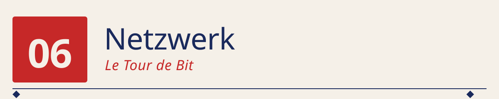
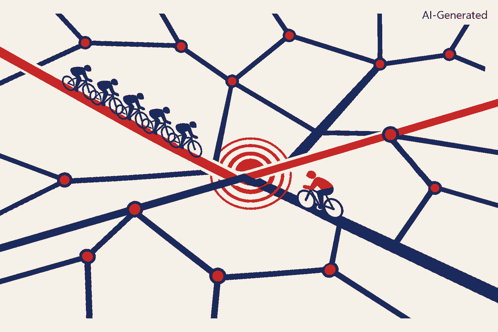

<p align="center">
  
</p>

<p align="center">
  
</p>

*Straßennetz = Kanal ◆ Fahrer = Sendungen ◆ Kreuzung mit Zusammenprall = Kollision ◆ Peloton = koordinierter Verkehr ◆ Einzelfahrer auf Nebenstraße = erfolgreicher Retry nach Backoff.*

──────────◆──────────◆──────────◆──────────◆──────────

> Ein einziges Blechkisten-Netz auf sieben Hawaii-Inseln, 1970. Sieben
> Rechner, ein UHF-Funkkanal, keine Absprache. Und eine Regel, die so
> simpel klingt, dass man sie beim ersten Hören für einen Scherz hält:
> *„Sende, wenn du etwas hast. Wenn's kollidiert — warte zufällig, dann
> nochmal."* Aus genau dieser Idee wurde in gut 20 Jahren das Internet.
> Und der mathematische Kern-Effekt — Kanal kollabiert bei Überlast, weil
> Kollisionen sich selbst verstärken — steckt bis heute in jedem WLAN-Chip.


## 🌉 Der Anfang: Wie kriegt man mehrere Rechner auf einen Kanal?

Am Ende von Kapitel 5 (`05_GPU`) haben wir gesehen, dass eine einzelne
GPU nicht reicht, um moderne KI-Modelle zu trainieren: GPT-3 lief auf
etwa 10 000 GPUs parallel. Aber „parallel auf 10 000 GPUs" heißt: die
Rechner müssen sich alle **paar Millisekunden über ein Netzwerk
synchronisieren**. Ohne Netzwerk kein verteiltes Training. Ohne
verteiltes Training kein GPT-3.

Die klassische Frage: **wie funktioniert das eigentlich, dass mehrere
Rechner sich ein gemeinsames Medium teilen?**

Die Antwort, die wir in diesem Kapitel bauen, ist die einfachste — und
historisch die erste, die funktioniert hat: **ALOHA**, geboren 1970 auf
Hawaii. Sie ist zu Netzwerken das, was die 4-Bit-CPU aus Kapitel 1 zu
Prozessoren ist: der minimale Prototyp, aus dem alles weitere durch
Skalierung und Verfeinerung entstanden ist.

---

## 🕰️ Historischer Kontext

| Jahr | Ereignis | Bedeutung |
|------|----------|-----------|
| **1970–71** | **ALOHAnet** (Norman Abramson, University of Hawaii) | Sieben Rechner auf verschiedenen Inseln teilen sich einen UHF-Funkkanal. Weltweit erstes funktionierendes Paket-Random-Access-Netz. |
| **1972** | **Slotted ALOHA** (Larry Roberts, ARPA) | Kleine Regel­änderung, doppelter Durchsatz — von 18,4 % auf 36,8 %. |
| **1973** | Metcalfe liest ALOHA-Paper | Und sieht: dieselbe Idee funktioniert auf Kupferkabel *besser*, weil man während des Sendens *zuhören* kann. |
| **1973/1976** | **Ethernet / CSMA/CD** (Metcalfe & Boggs, Xerox PARC) | „Höre, bevor du sendest; höre auch, während du sendest; brich bei Kollision sofort ab." Maximaler Durchsatz: 90 %+. |
| **1974** | **TCP/IP** (Vint Cerf, Bob Kahn) | Eine zweite Schicht über dem physischen Kanal: Adressierung, Fragmentierung, Retransmit. Ende-zu-Ende statt Nachbar-zu-Nachbar. |
| **1980** | IEEE 802.3 — Ethernet wird Standard | 10 Mbit/s. Damals absurd viel. |
| **1983** | ARPANET wechselt auf TCP/IP | Aus dem Forschungsnetz wird das Internet. |
| **1997** | **WLAN 802.11** (CSMA/CA) | Bei Funk ist Collision Detection wieder unmöglich (wie 1970!). Der ALOHA-Kern kehrt zurück. |
| **heute** | Ethernet 400 GbE, InfiniBand, RDMA | Der GPU-Cluster, auf dem GPT-3 trainiert wurde, benutzt dieselben Grund-Prinzipien: Framing, Kollisionsvermeidung, Retransmit. |

Zwei Beobachtungen:

**Erstens**, das Muster passt exakt zum Grund­tenor von `00_Fundament`
und `01_Computing/README.md`: Abramson hat ALOHA 1970 *gebaut*, ohne zu
wissen, ob die Mathematik dahinter aufgeht. Erst hinterher hat Roberts
1972 die geschlossene Formel $S = G e^{-G}$ dazu geschrieben. Klassischer
Zuse-Weg: erst probieren, dann verstehen.

**Zweitens**, ALOHA ist bis heute konzeptionell lebendig: **jeder
WLAN-Chip, jedes Bluetooth-Gerät, jedes LoRaWAN-Modem** benutzt eine
Variante desselben Grund­gedankens. Verändert wurde die *Robustheit* —
nicht der Kern.

---

## 🧠 Die Kernidee: probabilistischer Zugriff, mathematisch verstanden

Der ganze Trick von ALOHA lässt sich in einem einzigen Verhältnis fassen.

Wir haben einen Kanal. Wir haben Sender, die zufällig verteilte Pakete
absenden wollen. Die Frage: **wie viele der versuchten Sendungen kommen
ohne Kollision durch?**

Sei $G$ die *angebotene Last*, gemessen in „Sendeversuche pro
Paketlänge". Sei $S$ der *erfolgreiche Durchsatz*, ebenfalls in
Paketlängen. Dann gilt:

$$
S_{\text{Pure}} = G \cdot e^{-2G} \qquad
S_{\text{Slotted}} = G \cdot e^{-G}
$$

Maxima:

$$
S_{\text{Pure}}^{\max} = \frac{1}{2e} \approx 0{,}184 \quad \text{bei } G = 0{,}5
$$

$$
S_{\text{Slotted}}^{\max} = \frac{1}{e} \approx 0{,}368 \quad \text{bei } G = 1{,}0
$$

Das Bemerkenswerte ist das **Kollaps­verhalten bei Überlast**: bei $G > 1$
für Slotted (oder $G > 0{,}5$ für Pure) sinkt der Durchsatz *wieder*.
Mehr Sendeversuche → mehr Kollisionen → weniger erfolgreich zugestellte
Pakete. Ein Kanal, den man zu 100 % füllt, transportiert weniger als
einer, den man zu 37 % füllt.

Genau dieses Kollaps­verhalten ist der Grund, warum Netzwerke bis heute
mit *Traffic Shaping* und *Congestion Control* arbeiten. Und es lässt
sich in unserer Simulation live sehen.

---

## 🧠 Was du baust

Ein winziger, aber vollständiger ALOHA-Simulator in reinem Python:

- Eine **Kanal-Simulation** für Pure ALOHA und Slotted ALOHA. Sender
  wählen zufällig Sendezeitpunkte; Sendungen, die sich zeitlich
  überlappen, kollidieren.
- Ein **Durchsatz-Scan** über eine Reihe von Angeboten $G$, mit direktem
  Vergleich Simulation gegen theoretische Kurve.
- Eine **ASCII-Zeitachse**, auf der man Kollisionen *sieht* — Balken pro
  Sender, `!`-Marker bei Kollisions­zeitpunkten.
- Ein **ASCII-Balkenchart** der Slotted-ALOHA-Theoriekurve, damit das
  Maximum bei $G=1$ optisch sofort sichtbar ist.

Kein PyTorch, keine externen Pakete. Reines Python.

---

## 🚀 Schnelleinstieg

Die Struktur in `src/` und `notes/`:

```
src/
├── config.json         Simulations-Profile (small | medium | large)
├── aloha.py            Pure + Slotted ALOHA + Theoriekurven + ASCII-Rendern
└── test_aloha.py       Standalone-Beweis: Sim vs. Theorie, Zeitachse, Chart

notes/
└── ethernet.md         Ausblick: von ALOHA über CSMA/CD zu Ethernet, WLAN und TCP/IP
```

**Schritt 0 — die Kernidee ohne Vorwissen verstehen** *(kein PyTorch, kein Netz):*

```bash
python 01_Computing/06_Networks/src/test_aloha.py
```

Die Ausgabe liefert drei Blöcke:

1. **Tabelle** *simuliert vs. theoretisch* für 8 Lastpunkte. Kernwerte
   (verifiziert):
   - $G=0{,}50$: Pure sim=0,197 vs. th=0,184 ✓  |  Slotted sim=0,320 vs. th=0,303 ✓
   - $G=1{,}00$: Slotted sim=0,389 vs. th=0,368 ✓ *(nahe am 1/e-Maximum)*
   - $G=3{,}00$: Pure sim=0,009 — der Kanal ist praktisch tot.

2. **ASCII-Zeitachse** eines Mini-Laufs mit 3 Sendern, 2 Paketen, 6
   Sendungen. Man sieht 4 Kollisionen (`X`) und 2 Erfolge (`=`).

3. **ASCII-Balkenchart** der Kurve $S = G \cdot e^{-G}$ von $G=0{,}1$
   bis $G=4{,}0$ — mit deutlich sichtbarem Maximum bei $G=1{,}0$.

**Schritt 1 — den historischen Ausblick lesen:**

```
01_Computing/06_Networks/notes/ethernet.md
```

Zeigt in vier Verbesserungs­schritten, wie aus dem 18-%-Kanal von 1970
das heutige Internet wurde: ALOHA → Slotted ALOHA → CSMA → CSMA/CD
(Ethernet) → CSMA/CA (WLAN) → TCP/IP → 400 GbE / RDMA für GPU-Cluster.

Alle Python-Programme laufen mit **Python 3.7+** ohne externe
Abhängigkeiten.

---

## ❗ Ehrliche Diskussion: Was zeigt dieses Modell — und was nicht?

**Was es korrekt zeigt:**

- Den **Kollaps** bei Überlast — Kollisionen fressen den Durchsatz
  überproportional.
- Die **Verdopplung** durch Slotting — dass eine winzige Regel-
  Änderung (nur zu Slot-Grenzen senden) den Durchsatz doppelt so hoch
  bringt.
- Den Zusammenhang zwischen **Wahrscheinlichkeit und Systemverhalten** —
  ALOHA ist eines der ersten Beispiele in der Informatik, in denen ein
  probabilistischer Ansatz einem deterministischen (Time-Division-Multiplex,
  Master-Slave) klar überlegen ist, sobald die Zahl der Teilnehmer wächst.

**Was es bewusst *nicht* zeigt:**

- **CSMA/CD** — den eigentlichen Ethernet-Mechanismus. Der ist im
  Nachfolge-Notes-Dokument (`notes/ethernet.md`) erklärt, aber nicht
  simuliert. Der Grund ist derselbe wie überall in dieser Reihe: der
  einfache Fall (ALOHA) enthält bereits alle Grundideen, Skalierung ist
  danach *Verbesserung derselben Idee*.
- **TCP/IP-Schichten** — Adressierung, Fragmentierung, Congestion
  Control. Das ist eine ganze eigene Ebene über dem physischen Kanal
  und würde den Rahmen sprengen. Für einen ausführlichen Weg dorthin
  ist Kurose/Ross oder Tanenbaum die richtige Adresse.
- **Realistisches Backoff-Verhalten** — echte ALOHA-Systeme benutzen
  einen zufälligen Backoff-Wartezeitraum, damit kollidierte Sender sich
  statistisch entzerren. Unser Simulator arbeitet mit unabhängig
  gezogenen Sendezeitpunkten, was mathematisch äquivalent zum
  „steady-state"-Verhalten bei perfektem Backoff ist.

---

## 📝 Übungen

**1. Der Kollaps in einer Zeile.** Warum sinkt der Slotted-ALOHA-
Durchsatz für $G > 1$? Rechne die Ableitung $\frac{dS}{dG}$ nach — bei
welchem $G$ wird sie null? *(Antwort: $S = Ge^{-G}$, $\frac{dS}{dG}
= e^{-G}(1-G)$, null bei $G=1$. Maximum bei $G=1$: $S = 1/e$.)*

**2. Sender­dichte variieren.** Wie ändert sich der simulierte Durchsatz,
wenn du 50 Sender mit je 20 Paketen durch 10 Sender mit je 100 Paketen
ersetzt (gleiches $G$)? Sollte sich *nichts* ändern — verifiziere das.
Wenn doch etwas passiert, hast du einen Bug gefunden.

**3. Backoff bauen.** Erweitere `aloha.py` um eine „Retransmit"-
Logik: wenn ein Paket kollidiert, wird es nach einer zufälligen
Wartezeit erneut gesendet. Wie ändert sich der beobachtete Durchsatz?
*(Erwartung: qualitativ dieselbe Kurve, quantitativ näher an der
Steady-State-Theorie.)*

**4. Vom ALOHA-Kollaps zum CSMA-Sprung.** Formuliere in ein bis zwei
Sätzen, warum „vor dem Senden lauschen" (CSMA) den Maximaldurchsatz
gegenüber Slotted ALOHA verbessert. Bei welcher Größe wird die
Ausbreitungs­zeit des Signals wichtig? *(Antwort: sobald die
Signal-Laufzeit im Verhältnis zur Paket­länge nicht mehr klein ist —
genau der Grund, warum Abramson 1970 auf Hawaii kein CSMA
implementieren konnte.)*

**5. WLAN als moderner ALOHA-Nachfahre.** Wo im WLAN-802.11-Protokoll
findet man die alte ALOHA-Struktur wieder? *(Stichwort: „CSMA/CA mit
exponentiellem Backoff" — die Kollisions­vermeidung ist zwar
verbessert, aber der probabilistische Grund­ansatz ist identisch.)*

---

## 🧭 Wo steht ALOHA heute?

**Kurz gesagt:** die *reine* ALOHA-Regel wird heute in kaum einem
System mehr benutzt — sie ist überall durch CSMA-Varianten ersetzt. Aber
die *Idee* — probabilistischer Zugriff auf einen geteilten Kanal, mit
zufälligem Backoff bei Kollisionen — steckt in **jedem** Funknetz:

- **WLAN** (802.11): CSMA/CA + exponentielles Backoff. ALOHA ohne
  Detection-Trick.
- **Bluetooth**: Slotted-ähnlich, mit Master-koordinierten Slots, aber
  im Advertisement-Modus (Broadcast) reine ALOHA-Kollisionslogik.
- **LoRaWAN** (Low-Power WAN für IoT): Pure ALOHA. Bewusst gewählt,
  weil die Sensoren so selten senden, dass $G$ klein bleibt und die 18 %
  Maximum kein Problem sind.
- **RFID** (kontaktlose Karten): Slotted ALOHA für die Anti-Kollisions-
  Phase — mehrere Karten im Feld eines Lesegeräts finden sich per
  ALOHA-Ähnlichem Protokoll.

Man kann fast sagen: **wo Rechner ohne Kabel kommunizieren, lebt
Abramsons Idee weiter.**

---

## 🧠 Abschließende Bemerkungen

Wenn du dir dieses Kapitel angesehen hast, hast du gesehen, dass
Netzwerke nicht mit Adressen, Ports oder TCP anfangen. Sie fangen mit
einer viel elementareren Frage an: *wie kann ein Sender wissen, ob sein
Paket angekommen ist?* Und die einfachste ehrliche Antwort ist ALOHAs:
*„Ich weiss es nicht — ich sende es einfach und hoffe."* Dass diese
Haltung mit der richtigen Regel (Slotting, Sensing, Detection, Backoff)
Netze mit *90 %* Auslastung tragen kann, ist eines der schönsten
Ergebnisse der frühen Informatik.

Zwei Dinge, die man aus diesem Kapitel mitnimmt:

1. **Probabilistische Protokolle skalieren erstaunlich weit.** Ein Kanal
   ohne Absprache, ohne Master, ohne Zeitplan — wenn die Beteiligten
   sich statistisch fair verhalten, kommt am Ende mehr durch als bei
   perfekter Koordination mit hohem Overhead.

2. **Die Kollaps­kurve ist überall.** Nicht nur bei ALOHA. Genau
   dieselbe „mehr angeboten → weniger geliefert"-Dynamik findet man bei
   TCP-Congestion, bei Web-Servern unter Last, sogar bei einem
   Kreuzungsverkehr um 8 Uhr morgens. Der ALOHA-Simulator ist ein
   Miniatur-Modell für ein Muster, das in vielen komplexen Systemen
   wieder auftaucht.

---

## 🚀 Nächster Teil: von der Bitübertragung zur Bedeutung

Damit ist die klassische *„Wie funktioniert ein Computer?"*-Frage aus
Teil 1 vollständig beantwortet:

```
CPU  →  OS  →  Compiler  →  Perceptron  →  GPU  →  Netzwerk
```

Wir haben Rechner gebaut, Programme geschrieben, sie parallel laufen
lassen und über einen Kanal miteinander sprechen lassen. Aber:
**kein einziges der Bytes, die wir hier gesendet haben, wusste, ob es
eine Frage, eine Antwort oder ein Wörterbucheintrag ist.** Ein Rechner
kann jetzt Text *übertragen* — aber er *versteht* ihn nicht.

Um genau das zu ändern, brauchen wir eine ganz andere Art von Programm:
eines, das nicht *ausgeführt* wird, sondern *trainiert* wird. Damit
beginnt **Teil 2 (`02_MachineIntelligence/`)**: 60 Jahre neuronale
Netze, in denen aus einem einzelnen Neuron (Rosenblatt 1958) über MLP,
CNN, Word2Vec, RNN, Seq2Seq und Transformer schrittweise die Fähigkeit
entsteht, Bedeutung aus Text zu extrahieren. Und danach in Teil 3
(`03_LanguageModelling/`) die letzten zehn Jahre: aus einem Sprachmodell
wird ein Assistent, aus dem Assistenten ein reasoning-fähiges Modell,
aus dem reasoning-fähigen Modell ein Agent.

Der ganze Bogen läuft ab hier — auf denselben Netzwerken, auf denen wir
gerade unser erstes Paket gesendet haben, nur mit deutlich mehr
Bandbreite.

---

## 📚 Referenzen

- Abramson, N. (1970). *The ALOHA System — Another Alternative for
  Computer Communications*. AFIPS. Das Ur-Paper.
- Roberts, L. G. (1972). *ALOHA Packet System With and Without Slots and
  Capture*. ACM SIGCOMM Computer Communication Review. Die Slotted-
  Verbesserung mit geschlossener Formel.
- Metcalfe, R. M., & Boggs, D. R. (1976). *Ethernet: Distributed Packet
  Switching for Local Computer Networks*. Communications of the ACM.
- Kleinrock, L., & Tobagi, F. A. (1975). *Packet Switching in Radio
  Channels: Part I — Carrier Sense Multiple-Access Modes*. IEEE
  Transactions on Communications.
- Cerf, V., & Kahn, R. (1974). *A Protocol for Packet Network
  Intercommunication*. IEEE Transactions on Communications. TCP/IP-
  Grundlage.
- Tanenbaum, A. S., & Wetherall, D. J. (2011). *Computer Networks*
  (5. Aufl.). Der Standard-Lehrtext, der ALOHA in Kap. 4 ausführlich
  behandelt.
