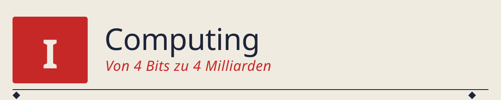

# Cover-Prompts für Teil 1 („Computing")

Diese Datei sammelt die Bild-Prompts, mit denen die Kapitel-Cover
generiert werden. Zielästhetik: **1980er europäische Elektronik-Album-
Cover-Ikonografie** — flach, geometrisch, keine Gesichter, keine
Gradienten, keine Fototextur.

**Empfohlener Bild-Generator:** Copilot Designer (copilot.microsoft.com,
DALL·E 3). Alternativ: Ideogram, Recraft, Adobe Firefly.

**Nach der Generierung:** immer `tools/recolor_cover.py` durchlaufen
lassen. Das Skript liest automatisch die kapitel-spezifische Palette
aus `tools/palettes.py` (basierend auf dem Bildpfad).

**Urheberrecht:** Weder im Prompt noch im Bild wird ein konkreter
Album- oder Bandname genannt. Wir übernehmen die *strukturellen*
Merkmale (Reduktion, Geometrie, flache Farben), nicht die konkreten
Motive.

---

## 🎨 Die Regel: sechs Paletten, ein Stil

Die Cover *sollen sich unterscheiden* — jedes Kapitel bekommt seine
eigene Farbwelt, thematisch angelehnt an das Album einer bestimmten
Ära. Was durch alle sechs Cover *gleich* bleibt:

1. **Nur vier flache Farben** pro Bild (Hintergrund, Struktur, Signal,
   Kontrast) — keine Verläufe, keine Zwischentöne.
2. **Geometrische Silhouetten**, keine Gesichter, keine realistischen
   Details.
3. **Format 16:9 landscape**, kein Text im Bild selbst.

Die konkreten Hex-Codes stehen in `tools/palettes.py` und sind in
jedem Prompt unten explizit genannt.

---

## 📖 Kapitel 00 — Fundament (Turing vs. Zuse)

**Thematischer Anker:** *Ralf & Florian* (1973). Warme Erdtöne, wie ein
altes Manuskript oder eine erste Zeichnung auf braunem Papier —
passend zum "Vor der Elektronik"-Motiv des Fundament-Kapitels.

**Bild-Kern:** Zwei Diagramme nebeneinander — links Papierband (Turing),
rechts Relais-Matrix (Zuse). Das Kapitel bekennt sich zum rechten Weg,
also ist die rechte Seite etwas prägnanter.

**Palette (`00_fundament`):**
- Hintergrund: `#EEE8DB` warmes Cream
- Struktur:    `#302820` dunkle Erde
- Signal:      `#AC2E1E` gedämpftes Zinnoberrot
- Kontrast:    `#1C1C20` Anthrazit

**Prompt:**

```
A minimalist, geometric poster illustration for a chapter about the
foundations of computing, contrasting two 1930s-40s approaches: the
mathematical (Turing machine) versus the engineered (electromechanical
relay computer).

Composition: two symbolic diagrams side by side on a warm cream
paper background.

Left half — Turing machine: a long horizontal paper tape drawn as a
thin outlined rectangle with small equally-spaced squares along its
length. Some squares contain simple abstract symbols (a dot, a small
cross, a bar), others are empty. Above the tape, a tiny schematic
read/write head. Overall feel: theoretical, sparse, mathematical.

Right half — relay matrix: a grid of small identical rectangles
arranged in a 6-row by 4-column matrix, each rectangle representing
an electromechanical relay. Some relays are filled solid, others are
outlines only. A few thin lines connect the relays to suggest
wiring. Overall feel: denser, warmer, physical.

Style: 1970s European electronic-music album cover aesthetic. Extreme
reduction. Flat color fills, no gradients, no shading, no textures,
no photorealism.

Palette (STRICT — use only these four flat colors):
- background:  #EEE8DB (warm cream)
- structure:   #302820 (dark earth brown)
- signal:      #AC2E1E (muted vermilion red) — used sparingly
- contrast:    #1C1C20 (anthracite) — for the finest details only

Absolutely no text, no logos, no other colors.
Format: 16:9 landscape.
```

---

## 📖 Kapitel 01 — CPU (die 4-Bit-CPU)

**Thematischer Anker:** *Autobahn* (1974). Klarer, geradliniger Fluss —
grau/blau/weiss, mit einer roten Markierung. Wie eine deutsche Autobahn
oder ein technisches Verkehrsdiagramm.

**Bild-Kern:** Der CPU-Bus als breite gerade Straße, Register/ALU/PC
als Blöcke daran angeschlossen, Instruktionen als Kolonne kleiner
Chevron-Pfeile darauf.

**Palette (`01_cpu`):**
- Hintergrund: `#E8E9EC` sehr helles Grau-Weiss
- Struktur:    `#202C4E` tiefes Verkehrsblau
- Signal:      `#DA3C3C` Marker-Rot
- Kontrast:    `#646973` neutrales Mittelgrau

**Prompt:**

```
A minimalist, geometric poster illustration for a chapter about a
simple 4-bit CPU. Aesthetic: a stylized technical diagram or a
1970s highway-junction plan.

Composition: a single wide horizontal band across the middle of the
image represents a computer bus, drawn as a broad flat strip running
left to right.

Attached to the top edge of the bus: four small identical rectangular
blocks, each labeled by a simple abstract icon (a circle, a square,
a triangle, a short horizontal bar). These represent registers, ALU,
program counter, and instruction register. Each block connects to
the bus by a short straight vertical line.

On the bus itself: five identical small chevron arrows moving from
left to right, evenly spaced. They represent instructions flowing
through the CPU.

Below the bus, a thin baseline runs in parallel, with four small
notches marking clock ticks.

Style: 1970s European electronic-music album cover aesthetic. Flat
color, no gradients, no shading, no photorealism. Extremely reduced,
like a printed technical schematic.

Palette (STRICT — use only these four flat colors):
- background:  #E8E9EC (very light cool grey)
- structure:   #202C4E (deep traffic blue) — bus, blocks, lines
- signal:      #DA3C3C (marker red) — the chevron instructions
- contrast:    #646973 (neutral mid-grey) — the clock baseline and notches

Absolutely no text, no logos, no other colors.
Format: 16:9 landscape.
```

---

## 📖 Kapitel 02 — OS (das Mini-Betriebssystem)

**Thematischer Anker:** *Radio-Aktivität* (1975). Gelb-Schwarz, mit
Warn-Ästhetik. Betriebssysteme sind wie Radio-Signale: sie kommen und
gehen, werden umgeschaltet, kollidieren.

**Bild-Kern:** Zwei Programm-Zonen (A und B), verbunden über einen
zentralen Scheduler-Schalter. Klar getrennt, aber gemeinsam getaktet.

**Palette (`02_os`):**
- Hintergrund: `#F5F0E6` Papier
- Struktur:    `#101014` sehr dunkles Schwarz
- Signal:      `#F0BE28` sattes Warngelb
- Kontrast:    `#C83C28` Alarm-Rot

**Prompt:**

```
A minimalist, geometric poster illustration for a chapter about a
minimal operating system doing context-switching between two programs.
Aesthetic: 1970s German electronic-music album cover with high-
contrast yellow-and-black warning signage.

Composition: the image is split vertically into two halves by a
central vertical pillar.

Left half — "program A": three small rectangles stacked vertically
with thin connecting lines. Program A is drawn in solid warning yellow.

Right half — "program B": three small rectangles in a slightly
different arrangement, connected by thin lines. Program B is drawn
in dark near-black.

At the exact center of the pillar: a small square symbol representing
the scheduler. From it, two thin arrows point outward — one to
program A, one to program B. One arrow is solid, the other dashed,
indicating "currently running vs. paused".

Below the whole scene: a horizontal clock ribbon with regular tick
marks and alternating tiny A/B markers.

Style: 1970s European electronic-music album cover aesthetic. Flat
color, no gradients, no shading, no photorealism. Extreme reduction.

Palette (STRICT — use only these four flat colors):
- background:  #F5F0E6 (warm off-white paper)
- structure:   #101014 (near-black, program B) — the dominant dark colour
- signal:      #F0BE28 (warm warning yellow, program A)
- contrast:    #C83C28 (alarm red) — used sparingly on the scheduler symbol only

Absolutely no text, no logos, no other colors.
Format: 16:9 landscape.
```

---

## 📖 Kapitel 03 — Compiler (vier Sprachen, ein Assembler)

**Thematischer Anker:** *Trans-Europa-Express* (1977). Schwarz-Rot auf
Weiss, mit einer klaren Bahn-Metaphorik. Vier Bahnlinien aus vier
Städten, die alle zum selben Bahnhof führen.

**Bild-Kern:** Vier Gleise, die auf einen zentralen Bahnhof zulaufen;
auf jedem Gleis ein anderes Zug-Muster. Zentrum: die CPU als
Hauptbahnhof.

**Palette (`03_compiler`):**
- Hintergrund: `#F5F0E8` Papier
- Struktur:    `#1E1E1E` neutrales Schwarz
- Signal:      `#C62828` Express-Rot
- Kontrast:    `#646464` Mittelgrau

**Prompt:**

```
A minimalist, geometric poster illustration for a chapter about
compilers: four different programming languages all compile to the
same underlying assembly. Aesthetic: 1970s trans-European rail
network schematic, with strict red-and-black on cream.

Composition: four thin straight lines (railway tracks) enter the
image from the four cardinal directions (top, right, bottom, left)
and converge in the exact center at a single circular node — the
"central station" representing the CPU / assembler.

On each of the four tracks, a small geometric train silhouette moves
toward the center. Each train is a simple horizontal rectangle with
a distinctive small pattern on its side, indicating its origin
language — for example: the top train has vertical stripes, the
right train has a checkered pattern, the bottom train has a dotted
pattern, the left train has a solid single-color body. Different
patterns, same destination.

At the center node, small chevron marks indicate that everything
converges to a single stream of instructions leaving the station
downward.

Style: 1970s European electronic-music album cover aesthetic. Flat
color, no gradients, no photorealism. Technical, schematic, extremely
reduced.

Palette (STRICT — use only these four flat colors):
- background:  #F5F0E8 (warm off-white paper)
- structure:   #1E1E1E (neutral black) — tracks, station, train outlines
- signal:      #C62828 (express red) — one train, the outgoing chevron
- contrast:    #646464 (mid-grey) — secondary track markings

Absolutely no text, no logos, no other colors.
Format: 16:9 landscape.
```

---

## 📖 Kapitel 04 — PerceptronOnCPU (das erste Perceptron als 16-Instruktions-Programm)

**Thematischer Anker:** *Die Mensch-Maschine* (1978). Rot-Schwarz auf
Weiss. Das eigentliche KI-Motiv des ganzen Buchs — eine mathematische
Idee wird zur maschinellen Berechnung.

**Bild-Kern:** Ein Neuron als Kreis mit Eingangs-Kanten, daneben ein
2×2-Klassifikations-Diagramm — drei Punkte in Rot, einer außerhalb der
Trennlinie (das XOR-Problem).

**Palette (`04_perceptron`):**
- Hintergrund: `#EEEAE2` Papier
- Struktur:    `#18181C` fast Schwarz
- Signal:      `#CC2020` kräftiges Neuron-Rot
- Kontrast:    `#8C8C8C` Mittelgrau

**Prompt:**

```
A minimalist, geometric poster illustration for a chapter about
Rosenblatt's perceptron as a 16-instruction assembly program on a
4-bit CPU. Aesthetic: 1970s German electronic-music album with
strict red-and-black man-vs-machine geometry.

Left half of the composition: a stylized artificial neuron drawn as
a single medium-sized circle in bright red. Two thin lines enter the
circle from the left (inputs x1 and x2), each labeled by a tiny
abstract geometric symbol (a small square for x1, a small triangle
for x2). Inside the circle, a simple horizontal line with a small
threshold marker. One thin line exits the circle to the right (the
output).

Right half: a 2x2 grid of four small dots representing the four
possible input combinations of a binary classification problem
(the corners of the XOR truth table). Three of the dots (top-left,
top-right, bottom-left) are drawn in red. The fourth dot
(bottom-right) is drawn in black. A single thin straight line
attempts to separate the red dots from the black one — but the
line clearly fails: it cannot separate them correctly. A small "X"
mark next to the black dot indicates the failure.

Style: 1970s European electronic-music album cover aesthetic. Flat
color, no gradients, no photorealism. Extremely reduced, schematic,
almost like a Bauhaus diagram.

Palette (STRICT — use only these four flat colors):
- background:  #EEEAE2 (warm off-white paper)
- structure:   #18181C (near-black) — the separation line, black dot, symbols
- signal:      #CC2020 (bright red) — the neuron, the three linearly-separable dots
- contrast:    #8C8C8C (mid-grey) — the connecting lines and axes

Absolutely no text, no logos, no other colors.
Format: 16:9 landscape.
```

---

## 📖 Kapitel 05 — GPU (Vom Grafikbeschleuniger zum KI-Rechenwerk)

**Thematischer Anker:** *Computerwelt* (1981). Grün-Schwarz-Ästhetik,
wie ein früher Computer-Terminal-Bildschirm. Rasterhaft, digital,
technisch. Passend zur SIMT-Idee: viele identische Zellen, ein
Programm.

**Bild-Kern:** Ein Grid identischer Zellen (die "Threads"), eine
grosse Warp-Instruktion daneben.

**Palette (`05_gpu`):**
- Hintergrund: `#F0EBE1` Papier
- Struktur:    `#121614` fast Schwarz
- Signal:      `#2C8A3C` Terminal-Grün (nicht Neon)
- Kontrast:    `#78766C` Mittelgrau

**Prompt:**

```
A minimalist, geometric poster illustration for a chapter about
GPU SIMT (single-instruction, multiple-thread) execution.
Aesthetic: early-1980s German electronic-music album, evocative of a
green computer terminal on paper.

Composition: a large rectangular grid of 8 columns by 4 rows = 32
cells fills the central two-thirds of the image. Each cell contains
a tiny identical upward-pointing arrow icon — all 32 arrows are
visually identical, indicating that every "thread" executes the same
instruction. The cells differ only in their background fill: each
cell is filled with a slightly different intensity of terminal
green, from almost-cream to full green.

To the left of the grid, outside its border: a single much larger,
thick arrow, pointing right (into the grid), drawn in near-black.
This represents the *one warp-wide instruction* that drives all 32
threads simultaneously.

Above the grid, a thin horizontal band with 8 tick marks
corresponding to the columns, suggesting time or clock cycles.

Style: 1980s European electronic-music album cover aesthetic. Flat
color, small stepped fills within cells (not gradients), no
photorealism. Geometric, technical, reduced.

Palette (STRICT — use only these four flat colors):
- background:  #F0EBE1 (warm off-white paper)
- structure:   #121614 (near-black) — grid outline, arrows inside cells, warp arrow
- signal:      #2C8A3C (terminal green) — the varied fills of the data cells
- contrast:    #78766C (mid-grey) — the tick marks above the grid

Absolutely no text, no logos, no other colors.
Format: 16:9 landscape.
```

---

## 📖 Kapitel 06 — Netzwerk (ALOHA) ✅ *bereits erzeugt*

**Thematischer Anker:** *Tour de France* (1983/2003). Sportliches
Weiss-Rot-Blau-Anthrazit einer 1980er-Radsport-Ästhetik.

**Bild-Kern:** Französisches Straßennetz als Kanal, Fahrer als Sender,
Kollision an einer Kreuzung als ALOHA-Kollision.

**Palette (`06_networks`):**
- Hintergrund: `#F5F0E8` Papier
- Struktur:    `#1A2A5C` TdF-Blau
- Signal:      `#C62828` Trikot-Rot
- Kontrast:    `#1C1C20` Anthrazit

*(Prompt bereits genutzt; siehe Git-Historie oder die frühere Version
dieser Datei.)*

---

## 📎 Praktische Hinweise

1. **Copilot Designer liefert 4 Varianten pro Prompt.** Wähle
   diejenige, die am klarsten die Kern-Metapher trifft, nicht die
   "schönste".

2. **Nach dem Speichern IMMER durch das Recolor-Skript schicken:**

   ```bash
   python tools/recolor_cover.py 01_Computing/0X_KapitelName/assets/cover.png
   ```

   Das erkennt automatisch die kapitel-spezifische Palette und
   erzeugt `cover_v2.png`. Diese `cover_v2.png` wird ins README
   eingebunden.

3. **SVG-Titelgrafik für das Kapitel erzeugen:**

   ```bash
   python tools/render_title_svg.py \
       --chapter 0X_kapitelname \
       --number "0X" \
       --title "Kapitelname" \
       --subtitle "Coole Zeile" \
       --output 01_Computing/0X_KapitelName/assets/title.svg
   ```

4. **Ins README einbauen** — nach dem Muster von 06/README.md:

   ```markdown
   <p align="center">
     
   </p>

   <p align="center">
     
   </p>

   *Metapher = X ◆ Metapher = Y ◆ Metapher = Z*
   ```
