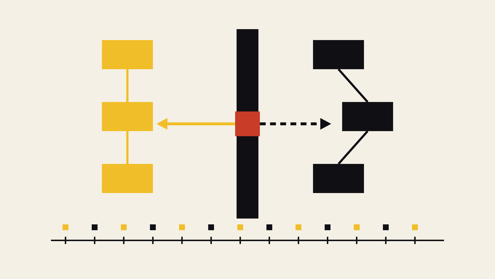

<p align="center">
  
</p>

<p align="center">
  
</p>

*Programm A + B = zwei Prozesse ◆ Scheduler in der Mitte = Umschalter ◆ Takt-Band unten = gemeinsame Zeitachse ◆ A/B-Marker = wer läuft gerade.*

──────────◆──────────◆──────────◆──────────◆──────────

> Wir bauen auf der 4-Bit-CPU des ersten Meilensteins ein **winziges kooperatives Multitasking-Betriebssystem** — mit **Segment-Register**, **Prozess-Tabelle im RAM** und **Context-Switch** bei jedem `YIELD`. Zwei Programme laufen quasi-gleichzeitig, jedes in seinem eigenen Speicher-Segment, und man kann live zuschauen, wie das OS zwischen ihnen umschaltet. Alles, was ein modernes OS macht — Speicherverwaltung, Scheduling, Prozess-Isolation — ist auf 200 Zeilen Python heruntergebrochen.

---

## 🌉 Der Anfang: Wie kommen zwei Programme auf eine CPU?

1955, an der Manchester University, läuft eines der ersten wirklichen Betriebssysteme: das **Atlas Supervisor**. Ferrantis Atlas-Rechner hat einen einzigen Prozessor, aber Dutzende von Nutzern und Programmen. Das Supervisor-Programm entscheidet, welches gerade läuft, verwaltet den Speicher und sorgt dafür, dass ein Programm dem anderen nicht in die Suppe spuckt. Das ist die Geburt der drei Kernaufgaben, um die jedes OS bis heute kreist:

1. **Speicherverwaltung** — jedes Programm bekommt seinen eigenen Adressraum
2. **Scheduling** — das OS entscheidet, welches Programm wann läuft
3. **Prozess-Isolation** — ein Programm sieht die Daten anderer Programme nicht

In diesem Meilenstein bauen wir diese drei Konzepte auf unserer 4-Bit-CPU nach — in extrem reduzierter Form, aber didaktisch ehrlich: **die Prozess-Kontexte liegen wirklich im RAM**, das **Segment-Register** existiert wirklich in der CPU, der **Kontext-Wechsel** ist wirklich beobachtbar.

Und der schönste Teil: das OS selbst ist so klein, dass man es an einem Nachmittag komplett verstehen kann.

---

## 🕰️ Historischer Kontext

| Jahr | Ereignis | Bedeutung |
|------|----------|-----------|
| **1955** | GM-NAA I/O (General Motors + North American Aviation) | Erstes echtes Batch-OS: Jobs werden aus einem Kartenstapel nacheinander abgearbeitet |
| **1961** | CTSS (MIT) | **Compatible Time-Sharing System** — mehrere Nutzer teilen sich einen Rechner, jedes Terminal glaubt, den Rechner ganz für sich zu haben |
| **1962** | Atlas Supervisor (Manchester) | Erstes OS mit **virtuellem Speicher** — Programme sehen einen "flachen" Adressraum, das OS mappt ihn auf physisches RAM |
| **1969** | Unix (Bell Labs) | Prozesse als First-Class-Objekt, `fork()`/`exec()`, Rechte-System. Grundlage aller heutigen Server-OS |
| **1975** | CP/M (Digital Research) | Erstes OS für Mikrocomputer — direkter Vorfahre von MS-DOS |
| **1984** | Mac OS 1.0 | **Kooperatives Multitasking** — Programme geben freiwillig ab, exakt das Modell, das wir hier bauen |
| **1995** | Windows 95 / Linux | **Preemptives Multitasking** mit Timer-Interrupt: das OS kann Programme unterbrechen, egal ob sie wollen oder nicht |

Zwischen unserem winzigen `MiniOS` und einem modernen Linux-Kernel liegen 60 Jahre Ingenieurskunst — aber die Grundzüge sind unverändert.

---

## 🧠 Die Aufgabe: „Zwei Zähler laufen gleichzeitig"

Wir starten zwei kleine Programme:

**`count_up.asm`** zählt hoch:
```asm
LDI 0            ; AX = 0
STA 0            ; RAM[0] = 0
LDA 0            ; AX = RAM[0]
LDB 1            ; BX = 1
ADD              ; AX += 1
STA 0            ; RAM[0] = AX
OUT              ; sichtbar
YIELD            ; gib Kontrolle ab
JMP 2            ; von vorne (Schleifenkopf)
```

**`count_down.asm`** zählt runter:
```asm
LDI $F           ; AX = 0xF
STA 0
LDA 0
LDB 1
SUB              ; AX -= 1
STA 0
OUT
YIELD
JMP 2
```

Beide Programme benutzen intern dieselbe RAM-Adresse `RAM[0]`. Aber sie liegen in **verschiedenen Segmenten**:
- `count_up` läuft in **SEG=1** → physisch `RAM[0x10..0x1F]`
- `count_down` läuft in **SEG=2** → physisch `RAM[0x20..0x2F]`

Der Trick: die CPU sieht bei jedem Speicherzugriff nur die logische 4-Bit-Adresse aus dem Programm, aber die Fetch-Logik der Control Unit rechnet automatisch:

$$
\text{phys}_{\text{addr}} = (\text{SEG} \ll 4) \;\; | \;\; \text{logical}_{\text{addr}}
$$

So denken beide Programme, sie hätten *ihre eigenen 16 Zellen* — und in gewissem Sinne haben sie das auch. Ein `STA 0` von `count_up` verändert `count_down`s Zähler nicht.

---

## 🧩 Architektur: was ist neu gegenüber der reinen CPU?

Nur zwei Dinge:

### 1. Segment-Register (SEG, 4 Bit)

Ein neues Bus-Element:

```python
class SegmentRegister(Element):
    """Segment-Register (4 Bit). Wird nur vom OS gesetzt —
    kein normaler Bus-Zugang für User-Programme."""
```

Wichtig: das SEG-Register hat **kein normales Bus-Gate**. Es steht bewusst NICHT im `elements`-Dict der CPU-Config, d.h. es gibt kein `SEG_IN`/`SEG_OUT`-Signal. Das SEG-Register kann nur durch **privilegierten Zugriff** vom OS gesetzt werden — genau wie in echter Hardware das Segment-Register (bei Intel: CS/DS/ES/SS) nur mit Ring-0-Berechtigung geschrieben werden darf.

### 2. `YIELD`-Opcode

Ein neuer Befehl, der wie ein NOP durchläuft, aber ein Flag setzt:

```python
"YIELD": [{"YIELD", "END"}]
```

Und im CPU-Kern:

```python
if "YIELD" in signals:
    self.yielded = True  # OS-Runner fragt das nach jedem Tick ab
```

Das ist konzeptuell ein **Software-Interrupt**: das Programm signalisiert dem OS "ich gebe freiwillig ab". Auf echter Hardware wäre das ein `INT`-Befehl.

### 3. RAM auf 256 Zellen

Der RAM wächst von 16 auf 256 Zellen, aufgeteilt in 16 Segmente à 16 Zellen. Angezeigt wird immer nur das gerade aktive Segment (bestimmt durch SEG); die Belegung der anderen Segmente steht als kompakte Übersicht darüber:

```
╔ RAM 16×16x4 ═══════════════════════════╗
║ seg: 0 1 2 3 4 5 6 7 8 9 A B C D E F   ║   ← Segment-Übersicht
║      0  1  2  3                        ║
║  0:  0  0  0  0                        ║   ← aktives Segment (4×4-Grid)
║  1:  0  7  0  0                        ║
║  2:  0  0  0  0                        ║
║  3:  0  0  0  0                        ║
║  seg=1  off=1   value = 7              ║
╚════════════════════════════════════════╝
```

## 🌀 Das Mini-OS

Das MiniOS ist eine Python-Klasse, die die CPU orchestriert:

```
MiniOS
├── Prozess-Tabelle  (2 Prozesse)
├── OS-Segment (SEG=0) im RAM — hält Prozess-Kontexte
├── tick()          ← wird stattdessen von cpu.tick() aufgerufen
└── context_switch() ← speichert alten, lädt neuen Kontext
```

### Speicher-Layout im OS-Segment (SEG=0)

| Adresse | Inhalt                        |
| :-----: | :---------------------------- |
| `0`     | PC von Prozess 0              |
| `1`     | AX von Prozess 0              |
| `2`     | BX von Prozess 0              |
| `3`     | SEG von Prozess 0 (=1)        |
| `4`     | PC von Prozess 1              |
| `5`     | AX von Prozess 1              |
| `6`     | BX von Prozess 1              |
| `7`     | SEG von Prozess 1 (=2)        |
| `...`   | (frei)                        |
| `F`     | aktuelle Prozess-ID (Anzeige) |

Beim Kontext-Wechsel passieren zwei Dinge:

**1. Save**: die aktuellen Werte der Register PC, AX, BX, SEG werden ins OS-Segment geschrieben.

```python
def _save_context(self, pid):
    base = pid * 4
    self.cpu.ram.cells[base + 0] = self.cpu.pc.value
    self.cpu.ram.cells[base + 1] = self.cpu.acc.value  # AX
    self.cpu.ram.cells[base + 2] = self.cpu.tmp.value  # BX
    self.cpu.ram.cells[base + 3] = self.cpu.seg.value
```

**2. Restore**: die Werte des nächsten Prozesses werden aus dem OS-Segment in die Register geladen.

```python
def _load_context(self, pid):
    base = pid * 4
    self.cpu.pc.value  = self.cpu.ram.cells[base + 0]
    self.cpu.acc.value = self.cpu.ram.cells[base + 1]
    self.cpu.tmp.value = self.cpu.ram.cells[base + 2]
    self.cpu.seg.value = self.cpu.ram.cells[base + 3]
    self.cpu.program = self.processes[pid].program   # Programm-Ptr
```

**Das ist alles.** In diesen 8 Zeilen Python steckt der Kern jedes Multitasking-Betriebssystems.

---

## ⚙️ Der Ablauf: was passiert bei einem YIELD?

Zeichnen wir einen Tick durch:

1. Prozess `up` läuft, sein PC steht auf 7 (`YIELD`-Befehl).
2. `cpu.tick()`:
   - CU dekodiert `YIELD` → Signal-Set `{YIELD, END}`
   - Weder Bus-Aktivität noch ALU-Op — YIELD ist reine Aktion
   - `apply_actions()` setzt `cpu.yielded = True`
3. `MiniOS.tick()` sieht: `cpu.yielded` ist wahr:
   - **Save**: schreibt `pc=8, ax=7, bx=1, seg=1` in `OS_SEG[0..3]`
   - **Round-Robin**: `current = 1`
   - **Load**: liest `pc=…, ax=…, bx=…, seg=2` aus `OS_SEG[4..7]` und schreibt in die Register
   - lädt `cpu.program = programs[1]` (den Code von `count_down`)
4. Nächster Tick: die CPU führt den `count_down`-Code aus — mit *ihrem* Zustand.

Und ganz nebenbei: SEG steht jetzt auf 2, also gehen `LDA 0` / `STA 0` in `count_down` automatisch nach `RAM[0x20]`. Kein Programm-Code muss das wissen.

---

## ▶️ So startest du das Programm

```bash
cd OS/src
python os_sim.py                                     # count_up + count_down
python os_sim.py programs/count_up.asm programs/count_down.asm  # explizit
```

Test (ohne Anzeige, für CI):
```bash
cd OS
python test_os.py
```

Voraussetzung: **Python 3.7+**, keine externen Abhängigkeiten. UTF-8-fähiges Terminal.

---

## 📈 Beispielausgabe (nach 200 Takten)

```
after 200 ticks:
  Prozess 'up'   (SEG=1) -> RAM[0]=7  yields=7
  Prozess 'down' (SEG=2) -> RAM[0]=8  yields=7
  OS-Segment (SEG=0)     -> [8, 7, 1, 1, 8, 8, 1, 2, ...]
  Current pid            -> 0
```

Lies das so:
- `up` hat 7-mal `YIELD` gemacht und steht bei 7 (also 0→1→...→7).
- `down` hat auch 7-mal `YIELD` gemacht und steht bei 8 (0xF→0xE→...→8).
- Im OS-Segment stehen beide Kontexte: `up`: PC=8, AX=7, BX=1, SEG=1. `down`: PC=8, AX=8, BX=1, SEG=2.

**Beide Prozesse liefen fair alternierend, jeder in seinem eigenen Segment.** ✓

---

## 🔒 Was heißt hier „Isolation"?

Die Prozesse können ihre Daten nicht gegenseitig überschreiben, weil **jeder von ihnen einen eigenen SEG-Wert hat** und dieser bei jedem RAM-Zugriff automatisch als High-Nibble der Adresse verwendet wird. Ein `STA 0` von `up` (SEG=1) schreibt in `RAM[0x10]`; dasselbe Programm mit SEG=2 würde in `RAM[0x20]` schreiben.

**Wichtig**: das ist nur ein *Schutz vor sich selbst*, kein Schutz vor bösartigem Code. Ein Programm, das die SEG-Grenzen kennt, könnte in Theorie sein Segment "verlassen" — wenn wir ihm die Möglichkeit gäben, SEG zu ändern. Aber genau das haben wir verhindert:

- Das SEG-Register hat kein `SEG_IN`-Bus-Signal.
- Kein Opcode im Mikrocode kann SEG beschreiben.
- Der einzige Weg, SEG zu ändern, ist der privilegierte OS-Code (`self.cpu.seg.value = ...` direkt in Python).

Das ist die simpelste denkbare Form von **Kernel-Mode-Schutz**.

---

## ❗ Ehrliche Diskussion: was zeigt dieses OS — und was nicht?

**Was es korrekt zeigt:**

- **Speicher-Segmentierung** (wie bei Intel 8086 CS/DS): logische vs. physische Adresse
- **Prozess-Kontext** (PC + Registers + Segment) im Kernel-Speicher
- **Context-Switch**: Save alter Zustand → Restore neuer Zustand
- **Kooperatives Multitasking** (wie Mac OS Classic, Windows 3.x)
- **Prozess-Isolation** durch Segmente
- **Kernel/User-Trennung** (SEG ist "privileged")

**Was es bewusst *nicht* zeigt:**

- **Preemptives Multitasking** — es gibt keinen Timer-Interrupt. Ein Programm, das kein `YIELD` macht, würde die CPU für immer belegen. Die Lösung wäre ein Zähler in der Simulation, der nach N Takten *für* das Programm ein YIELD auslöst — aber das haben wir bewusst weggelassen, um das YIELD-Prinzip klar zu zeigen.
- **Ein OS, das im RAM lebt und selbst Instruktionen ausführt** — unser OS ist Python-Code, der die CPU orchestriert. Realistischer wäre ein OS-Assembler-Programm, aber das würde weitere Konzepte brauchen (Interrupt-Handler, IRET, ...).
- **Programm-Loader aus Persistenz** — unsere Programme sind vor dem Start ins Python geladen und werden per `cpu.program = ...` gewechselt. Auf echter Hardware wären alle Programme gleichzeitig im PROG-ROM, und das OS würde nur PC + SEG umsetzen. Das ist der "Harvard-Fake", den wir im Code-Kommentar explizit machen.
- **Systemaufrufe** — es gibt kein "Syscall"-Konzept. In einem "echten" nächsten Schritt würde `YIELD` durch verschiedene Syscall-Nummern ergänzt: `SYS_WRITE`, `SYS_READ`, ...
- **Dateisystem, Netzwerk, GUI** — alles zu groß für 4 Bit.

Das ist die Idee — nicht das fertige OS.

---

## 📝 Übungen

**1. Verifiziere die Isolation.** Ändere `count_up.asm` so, dass es explizit `RAM[8]` beschreibt (z.B. `LDI 0xF; STA 8`). Startet das OS neu und schaue in die Segment-Übersicht: Segment 1 sollte `RAM[8]=0xF` haben, Segment 2 aber nicht.

**2. Was passiert bei fehlendem YIELD?** Nimm den `YIELD`-Befehl aus `count_up.asm` raus. Das Programm läuft dann in einer Endlosschleife und `count_down` kommt nie an die Reihe. Wie schnell erkennt man das (`count_up.RAM[0]` wächst, während `count_down.RAM[0]` bei 0xF bleibt)?

**3. Ein drittes Programm.** Der aktuelle MiniOS ist hart auf 2 Prozesse verdrahtet, aber im OS-Segment ist Platz für mehr. Erweitere `MiniOS.__init__` so, dass es beliebig viele Prozesse akzeptiert (solange sie in die 15 verfügbaren User-Segmente passen). Wie ändert sich das Rendering der Prozess-Tabelle?

**4. Zeitscheiben statt YIELD.** Ergänze `MiniOS.tick()` um einen Zähler `ticks_in_slice`. Wenn er einen Grenzwert (z.B. 20) erreicht, macht das OS einen erzwungenen Context-Switch — auch ohne YIELD. Das ist Preemption ohne Hardware-Interrupt. Wie beeinflusst der Grenzwert das Verhalten?

**5. Systemaufruf.** Definiere einen neuen Opcode `SYS n`. Wenn das Programm `SYS n` aufruft, macht das OS je nach `n` etwas Sinnvolles: `SYS 0` = "gib meinen SEG-Wert in AX zurück", `SYS 1` = "gib mir den Wert der aktuellen Uhrzeit" (z.B. tick_counter mod 16), etc. Zeigt: OS-Services über einen definierten Aufruf-Mechanismus.

---

## 🧭 Wo steht das Mini-OS heute?

- **Speicher-Segmentierung** war bis in die 1990er Jahre bei Intel Standard (real mode, 80286 protected mode). Erst mit dem 80386 kam **Paging** dazu; heutige 64-Bit-x86-CPUs benutzen Segmentierung praktisch gar nicht mehr, sondern nur noch Paging. **ARM** hat nie Segmentierung gehabt.
- **Kooperatives Multitasking** wurde 1995/2001 (Windows 95 bzw. Mac OS X) durch **preemptives** ersetzt. Der Vorteil: ein hängender Prozess kann das System nicht mehr blockieren. Der Preis: mehr Hardware (Timer-Interrupt) und ein komplexerer Scheduler.
- **Context-Switch** dagegen sieht bei modernen OS praktisch aus wie hier — nur eben mit deutlich mehr Registern (16-32 statt 3) und in Nanosekunden statt "einem Tick".

Und die schöne Klammer: **Docker-Container** und **virtuelle Maschinen** sind konzeptionell nichts anderes als die 60-Jahre-Weiterentwicklung des Atlas Supervisors: „gib jedem Prozess seinen eigenen Adressraum und seine eigene Sicht auf die Welt".

---

## 🧠 Abschließende Bemerkungen

Wir haben in diesem Meilenstein drei Dinge gemacht, die zusammen ein echtes Betriebssystem ausmachen:

1. **Segment-Register** in Hardware — jedes Programm bekommt seinen eigenen Adressraum.
2. **Prozess-Tabelle** im Kernel-Speicher — der Zustand jedes Prozesses ist explizit.
3. **Kontext-Wechsel** bei `YIELD` — der Kern jedes Multitasking-OS.

Das Zusammenspiel dieser drei Bausteine ist bereits die Grundstruktur eines Linux-Kernels — nur mit ein paar Milliarden Instruktionen mehr drum herum: Dateisysteme, Netzwerkstacks, Scheduler-Optimierungen, virtueller Speicher, Container, Sicherheit. Aber das *Grundmuster* ist da: **schütze die Hardware vor den Programmen, teile sie gerecht auf, halte den Zustand jedes Programms fest.** Der Rest ist Ausbau.

Und die schöne Parallele zu den Nachbarmeilensteinen:
- **Perceptron → GPT** ist Skalierung *eines* Neurons.
- **Minimal-CPU → moderner Prozessor** ist Skalierung *einer* Rechen-Einheit.
- **MiniOS → Linux/Windows** ist Skalierung *eines* Context-Switch-Mechanismus.

Immer dasselbe Muster: aus einem winzigen, klaren Baustein wird durch Vervielfältigung und Verfeinerung ein modernes System.

---

## 🚀 Nächstes Kapitel: Compiler

Damit haben wir die Kette *Hardware → Betriebssystem* geschlossen. Was fehlt, ist die *Programmiersprache*: bisher schreiben wir alles direkt in Assembler.

Der **Compiler-Meilenstein** übersetzt eine kleine Hochsprache in Assembler für die Zwei-Register-CPU:

```c
var x = 3
var y = 4
out = x + y
```

wird zu

```asm
LDI 3        ; x
STA 0        ; RAM[0] = x
LDI 4        ; y
STA 1        ; RAM[1] = y
LDA 0        ; AX = x
LDBM 1       ; BX = y
ADD          ; AX = x + y
OUT
HLT
```

Damit ist die komplette Software-Hardware-Kette abgedeckt:

```
Hochsprache   →   Compiler   →   Assembler   →   Mikrocode   →   Bus-Signale
                                       ↓                              ↓
                                     Prozess                      Hardware
                                       ↓
                                     Mini-OS ── verwaltet ─── mehrere Prozesse
```

...und jede Schicht ist in dieser Reihe **selbst programmiert**, ohne Frameworks.

---

## 📚 Referenzen

- Kilburn, T., Payne, R. B., & Howarth, D. J. (1961). *The Atlas Supervisor*. Proceedings of the Eastern Joint Computer Conference.
- Corbató, F. J., Merwin-Daggett, M., & Daley, R. C. (1962). *An Experimental Time-Sharing System (CTSS)*. Proceedings of the Spring Joint Computer Conference.
- Dijkstra, E. W. (1968). *The Structure of the "THE" Multiprogramming System*. Communications of the ACM, 11(5), 341–346. Das erste sauber strukturierte OS mit Schichten und Semaphoren.
- Ritchie, D. M., & Thompson, K. (1974). *The UNIX Time-Sharing System*. Communications of the ACM, 17(7), 365–375.
- Tanenbaum, A. S. (2015). *Modern Operating Systems* (4th ed.). Pearson. Der Standard-Referenz für alle OS-Konzepte, die wir hier in Miniatur nachbauen.
- Intel Corporation (1982). *iAPX 286 Programmer's Reference Manual*. Enthält die Beschreibung von Segment-Registern (CS/DS/ES/SS), der direkten Vorlage für unser SEG-Konzept.

---

# 🔀 Weg 2: Das OS *ist* ein Assembler-Programm

Der oben beschriebene `MiniOS` (Weg 1) ist ein Python-Programm, das die CPU von außen orchestriert. Das ist didaktisch klar, aber **inkonsequent**: die Kernelfunktionen (Context-Switch, Scheduling, Register-Zugriff) laufen außerhalb der Maschine, die wir gerade als "Computational Minimum" definiert haben. Aus dem Blickwinkel unserer 4-Bit-CPU ist das OS "Magie".

Weg 2 macht die Probe aufs Exempel: **kann man ein Betriebssystem in denselben 16 Opcodes schreiben, die auch die Nutzerprogramme benutzen?** Und passt es in 16 Instruktionen — also einen einzigen "Slot" im Programmspeicher?

Die Antwort ist ja. Wir bauen ein historisch früheres Modell nach: ein **Batch-OS** wie GM-NAA I/O (1955) oder das ATLAS Supervisor (1961). Kein Multitasking, keine Zeitscheiben — Programme laufen nacheinander, jedes bis zum HLT, dann wird das nächste geladen.

## 🧱 Die zwei Zutaten der Hardware

Um ein OS *in* der CPU laufen zu lassen, braucht es zwei minimale Hardware-Erweiterungen:

### 1. Base-Pointer (BP, 4 Bit) — segmentierter Programmspeicher

Der Programmspeicher wächst auf 256 Zellen = **16 Slots à 16 Instruktionen**. Ein neues Register `BP` selektiert den aktiven Slot:

$$
\text{instruction}_{\text{addr}} = (\text{BP} \ll 4) \;\; | \;\; \text{PC}
$$

- `BP = 0` → OS-Code
- `BP = 1..F` → bis zu 15 Nutzerprogramme

`BP` hat kein Bus-Gate (analog zu `SEG` in Weg 1) — d.h. es gibt kein Steuersignal, mit dem `BP` über einen normalen Opcode geschrieben werden könnte. Das ist die Simulations-Analogie zu Ring-0-Schutz.

### 2. Zwei neue Opcode-Semantiken

- **`SETBP`** — der einzige Weg, `BP` zu ändern:
  ```
  BP := BX
  PC := 0
  ```
  Damit verlässt das OS sich selbst und startet ein Nutzerprogramm.

- **`HLT`** — bekommt eine erweiterte Semantik. Wenn `BP ≠ 0`:
  ```
  BP := 0
  PC := 0
  ```
  Das heißt: `HLT` ist im Nutzer-Modus kein "Rechner stoppen", sondern ein **Trap zurück ins OS**. Nur wenn das OS selbst `HLT` ausführt, stoppt die Maschine wirklich.

**Und der elegante Trick**: Uninitialisierter Speicher (Opcode 0) *ist* `HLT`. Ein leerer Slot fällt also sofort ins OS zurück — vergleichbar mit dem `BRK`-Verhalten des 6502.

## 📜 Das OS in 10 Instruktionen

`programs/os.asm`:

```asm
; last_index in RAM[0]. Beim Boot ist RAM[0]=0.

LDA   0     ; 0: AX := RAM[0]        (last_index)
LDB   1     ; 1: BX := 1
ADD         ; 2: AX := AX + BX        (next_index)
JZ    5     ; 3: falls Overflow (15+1=0 in 4 Bit) -> Reset-Zweig
JMP   7     ; 4: sonst weiter zu STA
LDI   1     ; 5: Reset: AX := 1       (skip OS-Slot beim Wrap)
NOP         ; 6: fallthrough zu 7
STA   0     ; 7: RAM[0] := AX         (persistiere next_index)
MOV         ; 8: BX := AX             (SETBP nimmt BX)
SETBP       ; 9: BP := BX, PC := 0    (User-Prog starten -- OS-Ende)
```

**Das ist alles.** In 10 Instruktionen steckt:
- ein persistenter Job-Counter im RAM (`STA 0` speichert, `LDA 0` liest ihn zurück)
- ein Round-Robin-Scheduler durch alle 15 User-Slots
- ein Wrap-Around, der bewusst Slot 0 (=OS) überspringt, damit das OS sich selbst nicht als Job aufruft
- ein sauberer Kontroll-Transfer via `SETBP`

Der Rest — Kontext-Wiederherstellung, Scheduling-Entscheidungen — passiert nicht, weil er nicht gebraucht wird: es gibt keinen Kontext zu wiederholen (jeder Job startet frisch), und der Scheduler ist trivial (immer der nächste Index).

## ⚙️ Der Ablauf, Schritt für Schritt

```
Boot           : BP=0, PC=0, RAM[0]=0
                 → OS läuft ab Slot 0

OS-Durchgang 1 : RAM[0]=0, next=1, RAM[0]:=1
                 SETBP → BP=1, PC=0
                 → job1 läuft

job1 Ende      : HLT → BP=0, PC=0
                 → OS läuft wieder

OS-Durchgang 2 : RAM[0]=1, next=2, RAM[0]:=2
                 SETBP → BP=2, PC=0
                 → job2 läuft

... usw. bis Slot F, dann Wrap zurück zu 1.
```

Leere Slots (kein Programm geladen) enthalten Nullen = `HLT`. Ein Sprung dahin trappt sofort zurück ins OS — man sieht das schön im Log: pro leerem Slot exakt 2 Ticks (Fetch + Trap-Handling).

## 🧪 Ausprobieren

```bash
cd OS/src
python os_batch.py                                  # Default: job1 + job2
python os_batch.py programs/job1.asm programs/job2.asm  # explizit
```

Headless-Tests:
```bash
cd OS
python test_os_batch.py       # Ende-zu-Ende: OS lädt job1, job2, leere Slots
python test_os_batch_wrap.py  # Wrap-Around: F+1 → 1 (nicht 0!)
python test_os_batch_evil.py  # böser Job manipuliert OS-State (Übung)
```

## 🔓 Der große Punkt: es gibt *keinen* Speicherschutz

Der RAM hat weiterhin 16 Zellen, und **OS und User teilen ihn sich**. `RAM[0]` gehört per Konvention dem OS (dort liegt `last_index`), aber technisch kann jeder Job dort schreiben. Was passiert dann?

Wir haben das ausprobiert. `programs/job_evil.asm`:

```asm
LDI  7      ; AX := 7
STA  0      ; RAM[0] := 7   ← Übergriff auf OS-State!
OUT
HLT
```

Wird dieser Job als Slot 1 geladen, ergibt sich die Aufruf-Reihenfolge:

```
[1, 8, 9, A, B, C, D, E, F, 1, 8, 9, A, ...]
                                ^^^^^^ Slot 2 wird nie mehr aufgerufen
```

**Job 2 verhungert.** Bei jedem Wrap-Around kommt zwar wieder Slot 1 (job_evil) dran, der überschreibt `RAM[0]` wieder mit 7, und die Sequenz beginnt von vorne. Slot 2 hat keine Chance, jemals ausgeführt zu werden.

Aber — und das ist der entscheidende Punkt — **das System crasht nicht.** Es rechnet weiter, in einer manipulierten aber stabilen Schleife. Genau das war der Alltag der DOS- und CP/M-Ära: Programme, die Kernel-Speicher überschrieben, verursachten seltsame Effekte, aber selten sofortige Abstürze. Das lag daran, dass die *Struktur* des OS (im PROG-ROM) unantastbar war — nur die *Daten* des OS (im RAM) konnten korrumpiert werden.

Die drei Verteidigungslinien echter OS wurden genau als Antwort auf solche Bugs eingeführt:

1. **Speicherschutz (MMU, ab 1970er)** — verhindert, dass User-Code überhaupt in Kernel-RAM schreiben kann.
2. **Getrennte Adressräume (ab Unix, 1969)** — jeder Prozess sieht seinen eigenen RAM, nicht den des OS.
3. **Prüfen bei Systemaufrufen** — das OS überprüft, ob Argumente sinnvoll sind, statt blind zu glauben.

Wir haben nichts davon. Und wir sehen genau, wie sich das anfühlt.

## 🧭 Vergleich der beiden Wege

| Aspekt                | **Weg 1: `MiniOS`**            | **Weg 2: `os_batch`**                       |
| --------------------- | ------------------------------ | ------------------------------------------- |
| OS ist...             | Python-Klasse                  | Assembler-Programm                          |
| Läuft in...           | Python-Interpreter             | der CPU (BP=0)                              |
| Context-Switch        | Python setzt Register direkt   | `SETBP`/`HLT`-Trap                          |
| Speicherschutz        | ja (Segment-Register)          | nein                                        |
| Multitasking          | ja, kooperativ                 | nein, batch                                 |
| OS-Zeilen             | ~150 Zeilen Python             | 10 Zeilen Assembler                         |
| Historisches Vorbild  | Mac OS Classic, Windows 3.x    | GM-NAA I/O (1955)                           |
| Zeigt am besten       | Context-Switch, Isolation      | Boot, Ring-0-Konvention, unsicherer State   |

Die beiden Wege sind komplementär: **Weg 2 zeigt, wie ein OS *funktionieren kann* mit minimalen Mitteln**, Weg 1 zeigt, **was daraus wird, wenn man Isolation und Multitasking ernst nimmt**. In der Praxis kombiniert man beides — moderne Kernels sind selbst Programme (Weg 2) und haben trotzdem Isolation + Multitasking (Weg 1). Der Weg von unserer Batch-CPU zu einem realen Linux-Kernel führt über genau die drei oben genannten Verteidigungslinien.

## 📝 Übungen zum Batch-OS

**A1. Den bösen Job entfernen.** Ersetze `job_evil.asm` in `test_os_batch_evil.py` durch `job1.asm`. Ist die Aufrufreihenfolge jetzt wieder monoton? Warum?

**A2. Weniger böser Job.** Ändere `job_evil.asm` so, dass es nur `RAM[0] := 0` schreibt (statt 7). Was passiert? Tipp: der OS-Counter wird nie über 1 hinauskommen.

**A3. Der Killer-Job.** Kann man einen Job schreiben, der das OS *wirklich* zum Absturz bringt? (Idee: einen Job, der `SETBP` selbst benutzt und BP=0 setzt — dann liegt der PC im OS, aber die Register sind User-kontaminiert. Was passiert dann? Probiere es aus.)

**A4. Zeit-Instrumentierung.** Modifiziere `os.asm` so, dass es `OUT := next_index` macht, bevor es via `SETBP` verlässt. Dann kann man am OUT-Register live sehen, welcher Slot als nächstes drankommt. Kostet 1-2 zusätzliche Instruktionen (`STA` gegen `OUT` tauschen bringt nichts, denn OUT zerstört AX nicht).

**A5. Job-Ergebnisse einsammeln.** Ergänze `os.asm` so, dass es nach dem letzten Job (BP=F) selber `HLT` macht — also *nicht* wieder auf 1 wrapt. Das wäre ein "run once through all jobs, then halt"-Modell, wie es GM-NAA I/O tatsächlich hatte (der Rechner stoppte am Ende des Kartenstapels). Was muss du im OS-Code ändern? Bekommst du es in 16 Instruktionen?

## 🔮 Was fehlt (bewusst)

- **Kein Multitasking.** Ein Prozess läuft, bis er fertig ist. Das ist Batch, 1955. Für kooperatives Multitasking bräuchten wir einen `YIELD`-Opcode, der zusätzlich zum Kontrollwechsel *auch alle Register* speichert — und das führt uns zu mehrschrittigen Mikrocode-Sequenzen, die das Prinzip "eine Instruktion = ein Bus-Cycle" brechen. Der ehrliche Weg dorthin: entweder Auto-Push im YIELD (dann fett), oder ein Shadow-Register-File (dann mehr Hardware). Beides ist ein eigenes Kapitel wert.
- **Kein Speicherschutz.** Siehe oben — das ist Absicht.
- **Kein Loader.** Die Jobs werden vom Python-Runner in den PROG-ROM geschrieben. Ein "echter" Loader würde ein Programm von einem persistenten Medium (Band, Karten) in den Speicher lesen. Das wäre ein weiteres eigenes Kapitel (Bootloader, Format des Ladeprogramms usw.).
- **Kein Syscall.** Ein Job kann nichts vom OS anfordern (Zeit, andere Jobs, Speicher). Alle Kommunikation läuft indirekt über den RAM.

## 📂 Dateien zu Weg 2

```
OS/
├── src/
│   ├── cpu_sim/
│   │   ├── core.py                   ← erweitert um BasePointer, HLT-Trap, SETBP
│   │   └── config_batch_os.py        ← neue CPU-Config (BP + SETBP + HLT-Trap)
│   ├── programs/
│   │   ├── os.asm                    ← das OS in 10 Instruktionen
│   │   ├── job1.asm                  ← Beispiel: 3+4=7
│   │   ├── job2.asm                  ← Beispiel: Schleife bis 4
│   │   └── job_evil.asm              ← Übung: überschreibt OS-State
│   └── os_batch.py                   ← Runner mit Terminal-Visualisierung
├── test_os_batch.py                  ← End-to-End-Test
├── test_os_batch_wrap.py             ← Wrap-Around-Test (F+1 → 1)
└── test_os_batch_evil.py             ← Manipulation durch bösen Job
```
