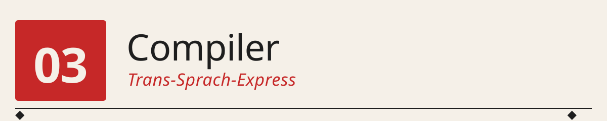
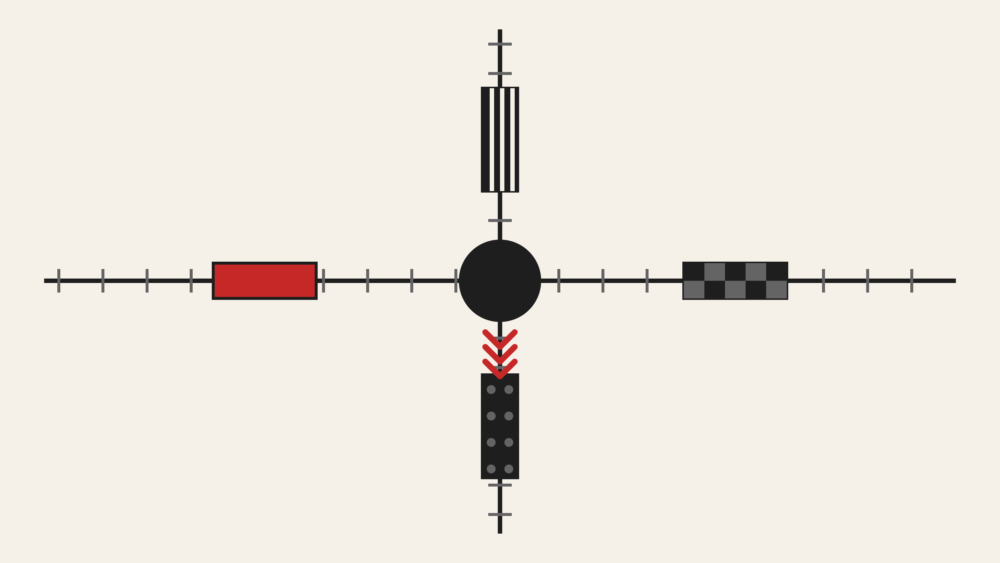

<p align="center">
  
</p>

<p align="center">
  
</p>

*Bahnlinien = Programmiersprachen ◆ Hauptbahnhof = CPU ◆ Züge = Programme ◆ dieselbe Ankunft = derselbe Assembler.*

──────────◆──────────◆──────────◆──────────◆──────────

> Wir schreiben **vier winzige Compiler** — für COBOL, FORTRAN, C und
> LISP —, die alle dieselbe kleine Aufgabe `(3 + 4) - 1 = 6` bearbeiten
> und in *identischen* Assembler-Code für unsere 4-Bit-CPU übersetzen.
> Der Aha-Moment: **der Technik ist egal, wie die Hochsprache aussieht.**

## 🌉 Warum Compiler die eigentliche Revolution waren

Der frühe Digitalcomputer war ein **Wechselstromgott**: unbändig schnell, aber nur ansprechbar durch mühsam von Hand gestrickte Folgen von 0en und 1en. In den ersten fünf Jahren der Computer-Ära (1946–1954) war "programmieren" ein Handwerk: jede Instruktion einzeln aufschreiben, mit Bleistift, auf Millimeterpapier, in Oktal. **Ein einfacher Additionsalgorithmus konnte einen Nachmittag kosten.**

Dann kam John Backus. 1954 begann er bei IBM ein Projekt, das als aussichtslos galt: eine "Formula Translator"-Software, die *mathematische Formeln direkt entgegennimmt* und daraus Maschinencode macht. Fortran erschien 1957. Der Widerstand war massiv:

> "Ein Compiler wird niemals so guten Code produzieren wie ein guter Programmierer von Hand!"

Es stellte sich heraus: **der Compiler produzierte oft besseren Code**, weil er systematisch alle Optimierungen anwenden konnte, die dem Menschen bei Zeile 3.000 des Assemblers zu langweilig wurden. Und viel wichtiger: er produzierte den Code in **Minuten statt Wochen**.

Von diesem Moment an waren Programmiersprachen nicht mehr *Werkzeuge zur Beschreibung von Rechenoperationen* — sie waren **Notationen, die dem menschlichen Denken folgen konnten**. Man konnte Formeln als Formeln schreiben. Prozeduren als Prozeduren. Objekte als Objekte. Der Computer musste sich anpassen, nicht der Mensch.

Und die Erfindung, die das ermöglichte, waren die 4 Zeilen Code in der Mitte dieses Kapitels: **ein Parser, ein AST, ein Codegenerator, ein Symbol-Table.**

---

## 🕰️ Ein kurzer Streifzug durch die Sprachgeschichte

| Jahr | Sprache | Wer / Warum |
|------|---------|-------------|
| **1954–57** | FORTRAN | John Backus (IBM). Erste erfolgreiche Hochsprache. Für Wissenschaftler, die Formeln aufschreiben können sollten. |
| **1958** | LISP | John McCarthy (MIT). Erste funktionale Sprache. "Code ist Daten": ein LISP-Programm ist selbst eine Liste, die von LISP verarbeitet werden kann. Bootstrapping in Reinform. |
| **1959** | COBOL | Grace Hopper & Konsortium. Erste **natürlichsprachliche** Sprache. Zielgruppe: Sachbearbeiter. `ADD Y TO X GIVING Z`. In Banken und Versicherungen läuft COBOL bis heute. |
| **1960** | ALGOL 60 | Internationales Komitee. Erste Sprache mit **formal definierter Grammatik** (BNF). Vorbild für Pascal, C, Java, Python … |
| **1964** | BASIC | Kemeny & Kurtz (Dartmouth). Für Studierende: einfach, interaktiv, mit Zeilennummern. Später auf den Heimcomputern der 80er das gemeinsame Erbe einer Generation. |
| **1972** | C | Dennis Ritchie (Bell Labs). "Portables Assembler". Klein genug, dass Unix damit auf jede neue Maschine portiert werden konnte. |
| **1985** | ABAP | SAP. Business-Anwendungen. `TYPES`, `TABLES`, `SELECT-OPTIONS`. Enterprise-Boilerplate at its finest. |
| **1991** | Python | Guido van Rossum. Einrückung als Syntax, keine Semikolons. "Executable Pseudocode". |
| **1995** | Java | James Gosling (Sun). Objektorientiert, portabel, mit Garbage Collection. "Write once, run anywhere." |
| **2009** | Go | Robert Griesemer & Rob Pike & Ken Thompson (Google). C für die Cloud. |
| **2014** | Swift | Apple. Moderne, sichere Nachfolgerin von Objective-C. |
| **2015** | Rust | Mozilla. C ohne Speicherbugs. |

**60 Jahre Sprachdesign** — und darunter liegt bei allen dieselbe *Berechnungsmaschine*: Register laden, addieren, subtrahieren, springen, speichern. Die Vielfalt ist reine Ergonomie.

---

## 🧠 Die Kernaufgabe: „(3 + 4) - 1 = 6"

Wir nehmen die einfachste Aufgabe, die trotzdem alle wesentlichen Bausteine einer Programmiersprache benötigt:

- **Zahl-Literale** (3, 4, 1)
- **Variablen** (x, y, z)
- **Zuweisungen** (x = 3)
- **Arithmetische Ausdrücke** (x + y - 1)
- **Ausgabe** (print z)

Und wir zeigen sie in **vier maximal verschiedenen Notationen**.

### C (1972)

```c
#include <stdio.h>

int main(void) {
    int x = 3;
    int y = 4;
    int z = (x + y) - 1;
    printf("%d\n", z);
    return 0;
}
```

### FORTRAN (1957)

```fortran
      PROGRAM ARITHMETIK
      IMPLICIT NONE
      INTEGER X, Y, Z
C     -- Kanonische Aufgabe: (3+4)-1 --
      X = 3
      Y = 4
      Z = X + Y - 1
      WRITE(*,*) Z
      STOP
      END PROGRAM
```

### LISP (1958)

```lisp
(defun main ()
  (let ((x 3) (y 4))
    (let ((z (- (+ x y) 1)))
      (print z))))
(main)
```

### COBOL (1959)

```cobol
       IDENTIFICATION DIVISION.
       PROGRAM-ID. ARITHMETIK.
       AUTHOR. STUDIERENDE.
       DATE-WRITTEN. 2024-01-15.
       DATA DIVISION.
       WORKING-STORAGE SECTION.
       01 X PIC 9.
       01 Y PIC 9.
       01 Z PIC 9.
       PROCEDURE DIVISION.
       BEGIN-PROGRAM.
           COMPUTE X = 3.
           COMPUTE Y = 4.
           ADD Y TO X GIVING Z.
           SUBTRACT 1 FROM Z.
           DISPLAY Z.
           STOP RUN.
       END-PROGRAM.
```

**Fünf Zeilen LISP, 18 Zeilen COBOL, dieselbe Rechnung.** Und dazwischen der ganze historische Reichtum an Design-Philosophien: mathematisch-elegant (FORTRAN), listenzentriert (LISP), pragmatisch (C), business-lesbar (COBOL).

---

## 🧩 Architektur: ein Compiler, vier Frontends

Der eigentliche Trick des Kapitels: **wir bauen nur *einen* Compiler**, aber mit vier auswechselbaren Frontends. Alle produzieren denselben internen **AST** (Abstract Syntax Tree), der dann von einem gemeinsamen Codegenerator in Assembler übersetzt wird.

```
        ┌────────────┐
COBOL ──┤  Frontend  ├──┐
        └────────────┘  │
        ┌────────────┐  │
FORTRAN ┤  Frontend  ├──┤
        └────────────┘  │       ┌──────┐        ┌──────────┐
        ┌────────────┐  ├──────►│ AST  ├───────►│ CodeGen  ├──► Assembler
C   ────┤  Frontend  ├──┤       └──────┘        └──────────┘
        └────────────┘  │
        ┌────────────┐  │
LISP ───┤  Frontend  ├──┘
        └────────────┘
```

Das ist **exakt die Architektur echter Compiler**. GCC (GNU Compiler Collection) hat Frontends für C, C++, Fortran, Ada, Go, D — alle produzieren dieselbe interne Repräsentation (GIMPLE, dann RTL), aus der der gemeinsame Backend-Optimierer und Codegenerator läuft. LLVM macht dasselbe mit LLVM-IR. **Frontends sind austauschbar, das Kernmodell ist eins.**

### Der AST

Er ist erstaunlich minimal (`src/astnodes.py`):

```python
@dataclass class Num:    value: int
@dataclass class Var:    name: str
@dataclass class BinOp:  op: str; left: object; right: object
@dataclass class Assign: name: str; expr: object
@dataclass class Output: expr: object
@dataclass class Program: statements: List[object]
```

Das ist alles. Aus diesen sechs Knotentypen lassen sich **alle** Programme unserer vier Sprachen darstellen. Der AST der Rechnung `(3+4)-1` ist immer derselbe, egal ob er aus COBOL oder LISP kommt:

```
Program
  Assign('x')
    Num(3)
  Assign('y')
    Num(4)
  Assign('z')
    BinOp('-')
      BinOp('+')
        Var('x')
        Var('y')
      Num(1)
  Output
    Var('z')
```

Der AST ist die **sprach-agnostische Zwischenrepräsentation**. Jedes Frontend ist nur ein Übersetzer von Text zu AST; der Rest des Compilers arbeitet auf diesem gemeinsamen Baum.

### Der Codegenerator

Der Codegenerator (`src/codegen.py`) ist ebenfalls minimal, weil das Zielmaschinenmodell klein ist:

- **`Num(n)`** → `LDI n` (Immediate in AX)
- **`Var(x)`** → `LDA <addr(x)>` (aus RAM in AX)
- **`BinOp(op, l, r)`**: linke Seite in AX kompilieren, rechte Seite in BX bringen (via `LDB`, `LDBM`, oder Zwischenspeicher), dann `ADD` / `SUB`
- **`Assign(x, e)`** → Ausdruck kompilieren, dann `STA <addr(x)>`
-**`Output(e)`** → Ausdruck kompilieren, dann `OUT`
- **`Program`** → alle Statements der Reihe nach, dann `HLT`

Die Symboltabelle ist ein Dictionary `{name → RAM-Adresse}`, dynamisch aufgebaut. Neue Variablen erhalten die nächste freie RAM-Zelle.

---

## 📊 Die Kernaussage in einer Tabelle

`test_compiler.py` kompiliert alle vier Beispiele und legt ihre Assembler-Sequenzen (ohne Kommentare, ohne Leerzeilen) nebeneinander:

```
     C                   FORTRAN             LISP                COBOL
     ------------------  ------------------  ------------------  ------------------
 0:  LDI 3               LDI 3               LDI 3               LDI 3
 1:  STA 0               STA 0               STA 0               STA 0
 2:  LDI 4               LDI 4               LDI 4               LDI 4
 3:  STA 1               STA 1               STA 1               STA 1
 4:  LDA 0               LDA 0               LDA 0               LDA 0
 5:  LDBM 1              LDBM 1              LDBM 1              LDBM 1
 6:  ADD                 ADD                 ADD                 ADD
 7:  LDB 1               LDB 1               LDB 1               STA 2
 8:  SUB                 SUB                 SUB                 LDA 2
 9:  STA 2               STA 2               STA 2               LDB 1
10:  LDA 2               LDA 2               LDA 2               SUB
11:  OUT                 OUT                 OUT                 STA 2
12:  HLT                 HLT                 HLT                 LDA 2
13:                                                              OUT
14:                                                              HLT
```

**Beobachtung 1: C, FORTRAN und LISP produzieren *identischen* Assembler.**
Obwohl die Quelltexte oberflächlich extrem unterschiedlich aussehen — geschweifte Klammern gegen `WRITE(*,*)` gegen S-Expressions —, führen sie zum selben AST und damit zum selben Maschinencode. Die Syntax ist reine Ergonomie.

**Beobachtung 2: COBOL erzeugt 2 Instruktionen mehr.**
Die Statement-Struktur `ADD Y TO X GIVING Z.` und `SUBTRACT 1 FROM Z.` sind zwei getrennte Anweisungen. Unser naiver Codegen kann sie nicht zu einem Ausdruck zusammenziehen, weil Constant Folding und Common Subexpression Elimination fehlen. Nach `Z := X + Y` wird zwischengespeichert und neu geladen, bevor `Z := Z - 1` erfolgt. Historisch akkurat — COBOL-Compiler waren selten für Optimierung berühmt.

Ein moderner optimierender Compiler würde die vier COBOL-Statements zusammenfassen und die Extra-Instruktionen sparen. Das ist die eigentliche Kunst des Compilerbaus: **Optimierung**.

---

## ▶️ So startest du den Compiler

```bash
cd Compiler
# Einzelne Sprache kompilieren:
python -m src.compile examples/arith.c
python -m src.compile examples/arith.f
python -m src.compile examples/arith.lisp
python -m src.compile examples/arith.cob

# Mit AST-Ausgabe:
python -m src.compile examples/arith.c --ast

# Kompilieren + direkt simulieren:
python -m src.compile examples/arith.lisp --run

# In eine .asm-Datei schreiben:
python -m src.compile examples/arith.c -o build/arith.asm
```

Test (kompiliert + simuliert alle 4 Sprachen, prüft OUT = 6):

```bash
python test_compiler.py
```

Voraussetzung: **Python 3.7+**, keine externen Abhängigkeiten. Der Compiler nutzt das CPU-Simulator-Framework aus `OS/src/cpu_sim/` über relative Import-Pfade.

---

## 🔬 Anatomie eines Compilers

Klassisch besteht jeder Compiler aus vier Phasen. Unser Mini-Compiler zeigt drei davon (die vierte, Optimierung, ist nur skizziert):

### 1. Lexer

Text → Folge von Tokens. Alle vier Frontends haben einen eigenen Lexer, weil die Token-Grammatik pro Sprache unterschiedlich ist:

- **C**: `int`, `main`, `{`, `}`, `;`, Identifier
- **FORTRAN**: `PROGRAM`, `END`, kein Case-Sensitivity, `C ...` als Zeilenkommentar
- **LISP**: nur `(`, `)`, Symbole, Zahlen
- **COBOL**: sehr viele Schlüsselwörter, `.` als Terminator

Alle Lexer nutzen dieselbe Technik: eine große Regex mit benannten Gruppen.

### 2. Parser (rekursiver Abstieg)

Tokens → AST. Alle vier Frontends benutzen rekursiven Abstieg. Das ist die Technik, mit der Ritchie 1972 den ersten C-Compiler geschrieben hat. Ein Python-Objekt mit `_peek`, `_eat`, `_accept` und Methoden pro Grammatik-Regel — die Struktur der Methoden entspricht der Grammatik 1:1.

Der Nachteil: linksrekursive Grammatiken funktionieren nicht direkt. Ausdrücke wie `a - b - c` (linksassoziativ) muss man mit einer Schleife im Parser bauen, nicht mit direkter Rekursion. Sieht man in `parse_expr` in allen vier Frontends.

### 3. Codegenerator

AST → Assembler. Rekursives Muster mit einer einfachen Invariante: *„nach dem Code, den ich für einen Ausdruck emittiere, liegt sein Wert in AX."* Diese Regel macht die Rekursion sauber:

```python
def gen_expr(BinOp(op, l, r)):
    gen_expr(l)          # AX := eval(l)
    <r nach BX bringen>  # BX := eval(r), ohne AX zu zerstören
    emit(op)             # AX := AX op BX
```

Diese Invariante ist die einfachste Version des sogenannten **„Register-Konventions-Modells"** — dem Kern jedes Codegenerators.

### 4. Optimierer (bei uns: keiner)

Ein echter Compiler würde hier ansetzen: Konstanten falten, gemeinsame Teilausdrücke eliminieren, Register-Allokation optimieren, tote Zuweisungen entfernen. Für die 4-Bit-CPU wäre das trivial und würde die 13 Instruktionen auf vielleicht 4 reduzieren (`LDI 6; OUT; HLT`). Aber das ist ein eigenes Kapitel wert.

---

## 📝 Übungen

**1. Multiplikation.** Erweitere den AST um `BinOp('*', ...)`. Unsere CPU hat kein `MUL`-Opcode. Du müsstest Multiplikation als wiederholte Addition ausrollen (z.B. `x * 3` → `x + x + x`).

**2. Ein fünftes Frontend.** Schreib ein Frontend für **Pascal** (`program`, `var`, `begin/end`) oder **BASIC** (`10 LET X = 3`, `20 PRINT X`). Wie viele Zeilen brauchst du?

**3. Boilerplate-Duell.** Miss für jede der vier Sprachen das Verhältnis (Boilerplate-Zeilen / Nutzcode-Zeilen). Welche ist am „boilerplate-effizientesten"? Wie ändert sich das Verhältnis bei einem größeren Programm?

**4. Constant Folding.** Modifiziere den Codegenerator so, dass er `BinOp('+', Num(3), Num(4))` direkt zu `Num(7)` reduziert. Wie viele Instruktionen spart das im Beispiel `(3+4)-1`?

**5. Kompiliere ins Batch-OS.** Nimm das kompilierte `arith.c` und lade es als Job in `os_batch` aus dem OS-Kapitel. Passt es in einen 16-Instruktionen-Slot?

**6. Fehlermeldungen.** Baue eines der Frontends so um, dass es bei Syntax-Fehlern die Zeilennummer der fehlerhaften Stelle ausgibt.

---

## 🧭 Wo stehen die vier Sprachen heute?

- **FORTRAN** lebt in der Wissenschaft (Klimasimulation, Numerik) weiter. Legacy-Code aus den 70ern rechnet auf Supercomputern nach wie vor Klimamodelle. Aktuelle Version: Fortran 2023.
- **LISP** lebt in Nischen (Emacs Lisp, Clojure, Racket) und ist Vorbild aller funktionalen Sprachen. Ohne LISP kein Haskell, kein Scala, keine Lambda-Ausdrücke in Java.
- **COBOL** läuft immer noch bei sehr vielen Banken, Versicherungen und Behörden. IBM schätzt: **220 Milliarden Zeilen COBOL** sind aktuell in Produktion. Zu wenig Nachwuchs, akuter Fachkräftemangel.
- **C** ist die *lingua franca* des Systemprogrammierens. Linux, Windows-Kernel, Web-Server, Datenbanken, Firmware — alles in C. Fast jede moderne Sprache benutzt C für ihre Runtime.

Vier Sprachen, drei davon älter als die meisten Studierenden. Alle laufen bis heute. Und alle kompilieren auf ihrer jeweiligen Ziel-CPU zu denselben grundlegenden Maschinenbefehlen — so wie hier auf unserer 4-Bit-CPU.

---

## 🧠 Abschließende Bemerkungen

Wir haben in diesem Meilenstein die Kette **Hochsprache → Assembler → CPU** geschlossen. Zusammen mit dem CPU- und OS-Kapitel ergibt sich die komplette vertikale Software-Hardware-Achse:

```
Hochsprache (4 Sprachen)
      │
      ▼  Compiler (dieses Kapitel)
Assembler (16 Opcodes)
      │
      ▼  CPU-Simulator (Meilenstein 1)
Mikrocode + Bus-Signale
      │
      ▼  Betriebssystem (Meilenstein 2)
Prozess-Scheduling (in Assembler!)
```

Jede Schicht ist in dieser Reihe **selbst programmiert**, ohne Frameworks. Vom Bit bis zum Programm ist alles handgemacht.

Und der schönste Teil: der Kern des Compilers — Parser, AST, Codegen, Symboltabelle — kommt mit weniger als 400 Zeilen Python aus. Das war die Erfindung, die die Programmierbarkeit demokratisiert hat.

---

## 📚 Referenzen

-- Backus, J. et al. (1957). *The FORTRAN Automatic Coding System*. Proceedings of the Western Joint Computer Conference. Der Grundlagenartikel — Backus beschreibt darin nicht nur die Sprache, sondern auch den ersten optimierenden Compiler-Bau.
- McCarthy, J. (1960). *Recursive Functions of Symbolic Expressions and Their Computation by Machine, Part I*. Communications of the ACM, 3(4), 184–195. Die Geburt von LISP.
- Sammet, J. E. (1969). *Programming Languages: History and Fundamentals*. Prentice-Hall. Die maßgebliche Frühgeschichte der Programmiersprachen.
- Aho, A. V., Lam, M. S., Sethi, R., & Ullman, J. D. (2007). *Compilers: Principles, Techniques, and Tools* (2nd ed.). Der berühmte „Dragon Book" — die Standardreferenz für alles, was wir hier in Miniatur nachbauen.
- Ritchie, D. M. (1993). *The Development of the C Language*. Second History of Programming Languages Conference. Erzählt aus erster Hand, wie C in Bell Labs entstand.
- Wirth, N. (1996). *Compiler Construction*. Addison-Wesley. Kurzes, elegantes Buch über Compilerbau am Beispiel von Oberon — Wirth war Meister des Minimalismus.
- Hopper, G. M. (1978). *The Early History of COBOL*. History of Programming Languages I. Grace Hopper selbst über den Entstehungsprozess der ersten „business-lesbaren" Sprache.