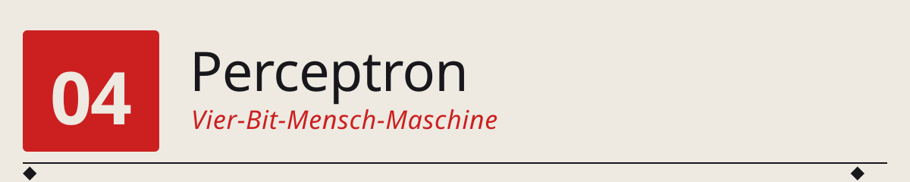
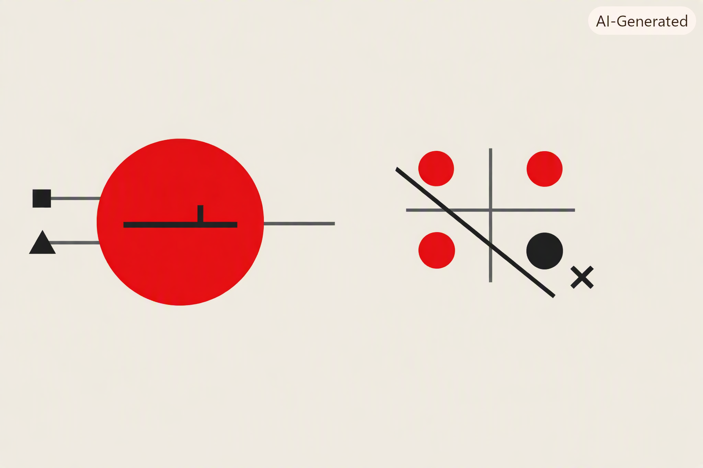

<p align="center">
  
</p>

<p align="center">
  
</p>

*Neuron = w·x + b + Schwelle ◆ drei Punkte trennbar = AND/OR/NAND ◆ vierter Punkt ausserhalb = XOR ◆ eine Gerade reicht nicht.*

──────────◆──────────◆──────────◆──────────◆──────────

> Wir bauen das **erste künstliche Neuron** (Rosenblatt 1958) als Assembler-Programm auf **unserer eigenen 4-Bit-CPU**. In 16 Instruktionen. Und wir sehen empirisch, was Minsky & Papert 1969 mathematisch bewiesen: `AND`, `OR`, `NAND` — kein Problem. `XOR` — geht nicht. Genau dieses Ergebnis stürzte die KI-Forschung in ihren ersten Winter.

---

## 🌉 Der Übergang zwischen Teil 1 und Teil 2

Die letzten drei Kapitel haben eine 4-Bit-CPU (Kapitel 1), ein Batch-OS (Kapitel 2) und einen Compiler (Kapitel 3) auf ihr aufgebaut. Alles zusammen ist eine kleine, aber vollständige Rechenmaschine.

Was fehlt noch, bevor wir zur eigentlichen KI-Reise in Teil 2 aufbrechen? **Der Nachweis**, dass diese Maschine — so klein sie ist — bereits das Fundament für alles ist, was in Teil 2 kommt. GPT läuft auf einer CPU. GPT ist Milliarden mal komplexer als unser Perceptron. **Aber der Kern ist derselbe.**

Und weil in Teil 2 die neuronalen Netze als *mathematisches Konzept* eingeführt werden, wollen wir sie hier einmal als *Programm* sehen: **Assembler-Instruktionen, die auf einer echten CPU laufen.**

---

## 🕰️ 1957: Rosenblatt baut das erste Perceptron

Am 7. Juli 1958 stellt Frank Rosenblatt vom Cornell Aeronautical Laboratory sein Perceptron der Presse vor. Die New York Times titelt am nächsten Tag:

> „New Navy Device Learns By Doing … The embryo of an electronic computer that the Navy expects will be able to walk, talk, see, write, reproduce itself and be conscious of its existence."

Das ist Werbung im Kalten Krieg. Aber die Maschine — der **Mark I Perceptron** — ist echt. Sie ist einige Meter breit, hat 400 photoelektrische Sensoren als „Netzhaut", und **8 Ausgabeneuronen**. Jedes Ausgabeneuron macht genau das, was wir hier auf unserer 4-Bit-CPU nachbauen:

$$
y = \begin{cases} 1 & \text{wenn } \sum_i w_i x_i + b > 0 \\ 0 & \text{sonst} \end{cases}
$$

- Gewichte `w_i` werden durch **motorbetriebene Potentiometer** eingestellt (kein Trocken-Silizium, sondern echte Elektromotoren, die die Widerstände drehen)
- Trainiert wird per **Rosenblatts Perceptron-Regel**: wenn das Neuron falsch klassifiziert, werden alle Gewichte in Richtung des korrekten Ergebnisses verschoben
- Das Ding lernt tatsächlich, einfache Muster auf 20×20-Pixel-Bildern zu klassifizieren

Rosenblatt behauptet zu viel, aber sein Modell ist mathematisch solide. Der Aufsatz *„The Perceptron: A Perceiving and Recognizing Automaton"* (1957) ist bis heute die Geburtsurkunde der neuronalen Netze.

---

## 🧠 Was wir bauen

Ein Perceptron mit **zwei Eingängen**, **zwei Gewichten** und einem **Bias**:

```
       x1 ─── w1 ──┐
                    (+)─── > 0 ? ──► y (0 oder 1)
       x2 ─── w2 ──┤
                    │
             b ─────┘
```

**Formel:** `y = 1 wenn (w1·x1 + w2·x2 + b) ≥ 0, sonst 0`

**Werte:** Alles 4-Bit-Zweierkomplement: 0..7 positiv, 8..F negativ (= -8..-1). Für unsere logischen Aufgaben genügen `x ∈ {0, 1}`, `w ∈ {-2, -1, 0, +1, +2}`, `b ∈ {-2, -1, 0, +1}`. Die Multiplikationen `w·x` bleiben damit sicher im 4-Bit-Bereich.

---

## 🔧 Zwei neue Opcodes: MUL und JN

Die klassische 16-Opcode-CPU von Kapitel 1 (`config_two_reg`) hat kein MUL — das braucht das Perceptron aber. Und sie hat kein „Jump if Negative" — auch das brauchen wir für den Schwellwert-Vergleich.

Deshalb bauen wir eine **erweiterte Variante** `config_two_reg_mul.py`, die zwei zusätzliche Opcodes einführt:

| Opcode | Semantik | Warum |
|--------|----------|-------|
| **`MUL`** | `AX := (AX × BX) mod 16`, Carry setzt bei Overflow | Multiplikation als Ein-Zyklus-Operation. Historisch war das ein Barrel-Multiplier — teuer in Silizium, aber schnell. |
| **`JN`** | Springe, wenn oberstes Bit von AX gesetzt ist (= AX ist negativ in 2K) | Damit ist der Vergleich `sum < 0` **eine einzige Instruktion**. |

**Was fällt weg?** `NOP` — den brauchen wir eh nicht, und wir müssen im 16-Opcode-Rahmen bleiben. Wer eine leere Operation will, kann `JMP` auf die nächste Adresse machen.

Die vollständige neue Opcode-Tabelle:

```
LDI  BX←imm         ADD  AX←AX+BX          JMP  PC←imm
LDB  BX←imm         SUB  AX←AX-BX          JC   PC←imm if C=1
LDA  AX←RAM[a]      MUL  AX←AX·BX  (NEU)   JZ   PC←imm if AX==0
LDBM BX←RAM[a]      MOV  BX←AX             JN   PC←imm if AX<0  (NEU)
STA  RAM[a]←AX      OUT  OUT←AX            HLT  halt
```

---

## 📜 Das Perceptron-Programm: 16 Instruktionen

Der komplette Assembler-Code in `src/programs/perceptron.asm`:

```asm
LDA 1        ; 0: AX := x2
LDBM 3       ; 1: BX := w2
MUL          ; 2: AX := x2 * w2
LDBM 4       ; 3: BX := b
ADD          ; 4: AX := x2*w2 + b
STA 5        ; 5: partial := AX
LDA 0        ; 6: AX := x1
LDBM 2       ; 7: BX := w1
MUL          ; 8: AX := x1 * w1
LDBM 5       ; 9: BX := partial
ADD          ; A: AX := x1*w1 + x2*w2 + b
JN  E        ; B: if AX < 0 -> E (fires 0)
LDI 1        ; C: AX := 1
JMP F        ; D: skip 0-branch
LDI 0        ; E: AX := 0
OUT          ; F: OUT := y
```

**Genau 16 Instruktionen — die exakte Größe eines Programmspeicher-Slots.** Das ist kein Zufall: die 4-Bit-CPU kann nicht mehr adressieren. Der Perceptron ist der Fall, an dem die 4-Bit-Grenze **exakt** bindend wird — und das ist die eigentliche didaktische Pointe des Kapitels.

**Warum kein HLT?** Weil es genau nicht mehr reinpasst. In der reinen CPU (ohne Batch-OS) wraps der PC nach Adresse F zurück auf 0. Der Test-Runner erkennt das und bricht ab (siehe `test_perceptron.py`). Alternativ könnte man das Programm in einen Batch-OS-Slot laden — dann übernimmt der leere Slot nach Adresse F als HLT-Trap.

---

## 🧪 Die Experimente

`test_perceptron.py` konfiguriert das Perceptron für **AND**, **OR**, **NAND** und testet alle vier Eingabekombinationen `(x1, x2) ∈ {0,1}²`:

### AND: feuert nur bei (1,1)

Gewichte: `w1=1, w2=1, b=-2`. Die Summen sind:

| x1 x2 | Summe | Feuern? |
|:---:|:---:|:---:|
| 0 0 | -2 | 0 ✓ |
| 0 1 | -1 | 0 ✓ |
| 1 0 | -1 | 0 ✓ |
| 1 1 |  0 | 1 ✓ |

### OR: feuert außer bei (0,0)

Gewichte: `w1=1, w2=1, b=-1`.

### NAND: feuert außer bei (1,1)

Gewichte: `w1=-1, w2=-1, b=1`.

**Alle drei: 4/4 korrekt klassifiziert.** Rosenblatts Perceptron kann lineare Klassifikatoren lernen — und diese drei booleschen Funktionen sind linear trennbar.

---

## ❌ Und dann kommt XOR

`XOR(x1, x2) = 1 wenn genau eines von beiden 1 ist`. Die Wahrheitstabelle:

| x1 x2 | XOR |
|:---:|:---:|
| 0 0 | 0 |
| 0 1 | 1 |
| 1 0 | 1 |
| 1 1 | 0 |

Wenn wir das im 2D-Raum plotten:

```
   x2
    │
  1 ●   ○
    │
  0 ○   ●
    └──────► x1
      0   1

  ●  = XOR liefert 1
  ○  = XOR liefert 0
```

**Man kann keine gerade Linie ziehen**, die die ●-Punkte von den ○-Punkten trennt. Ein Perceptron aber kann geometrisch *nur* eine Trenn-**Gerade** ziehen: `w1·x1 + w2·x2 + b = 0` ist die Gleichung einer Geraden im `(x1, x2)`-Raum.

Der Test durchsucht deshalb **alle 512 Kombinationen** von `(w1, w2, b) ∈ {-4..+3}³`, und **keine** liefert 4/4. Das Maximum ist 3/4. Empirischer Beweis dessen, was Minsky & Papert in ihrem Buch *„Perceptrons"* (1969) mathematisch formal bewiesen.

---

## 🕰️ 1969: Der KI-Winter beginnt

Marvin Minsky und Seymour Papert, beide MIT, veröffentlichen 1969 das Buch **„Perceptrons: An Introduction to Computational Geometry"**. Darin beweisen sie mit mathematischer Strenge:

> *„Ein einfaches Perceptron kann keine Funktion berechnen, die nicht linear trennbar ist."*

XOR ist ihr berühmtestes Beispiel. Sie beweisen es aber für eine ganze Klasse von Problemen: **Konnektivität von Bildern**, **Symmetrie**, **Parität**. Alles Aufgaben, die für einen einfachen Perceptron **prinzipiell nicht lösbar** sind.

Rosenblatt hatte 1957 zwar ein *mehrschichtiges* Perceptron im Kopf, aber es gab noch keinen Algorithmus, um mehrere Schichten zu trainieren (der käme erst 1986 mit **Backpropagation**). Das Buch von Minsky & Papert wird deshalb als **das Ende der ersten KI-Welle** gelesen. Die Fördergelder für neuronale Netze versiegen. Rosenblatt selbst stirbt 1971 bei einem Bootsunglück, mit 43 Jahren. Die Forschung an neuronalen Netzen liegt fast **17 Jahre brach**.

Das ist der **erste KI-Winter**. Er dauerte, bis Rumelhart, Hinton und Williams 1986 den **Backpropagation-Algorithmus** neu veröffentlichten und damit *mehrschichtige* Perceptron-Netze trainierbar machten. Ab dann konnte man XOR — und alles andere — mit einer versteckten Schicht lernen. Das ist genau der Ausgangspunkt von Kapitel 2 in `02_MachineIntelligence`.

---

## ▶️ So startest du das Programm

```bash
cd 01_Computing/04_PerceptronOnCPU
python test_perceptron.py
```

Der Test macht folgendes:
1. Lädt `src/programs/perceptron.asm` (16 Instruktionen)
2. Für jede der drei Aufgaben AND/OR/NAND: setzt die Gewichte (w1, w2, b) und die vier Eingaben (0,0), (0,1), (1,0), (1,1) ins RAM, lässt das Programm laufen, liest das Ergebnis aus OUT.
3. Für XOR: durchsucht alle 512 Gewichts-Kombinationen aus {-4..+3}³, findet die beste, zeigt dass sie maximal 3/4 erreicht.

Erwartete Ausgabe: 4/4 für AND/OR/NAND, 3/4 als Bestwert für XOR.

---

## 🧭 Was dieser Übergang zeigt

Dieses Kapitel ist die eigentliche Klammer zwischen Teil 1 und Teil 2:

**Aus der Perspektive von Teil 1 (Computing) klärt es:**
- Was ist ein neuronales Netz aus Sicht einer CPU? — Ein Programm. Und zwar ein sehr kurzes. Kein Zauber, keine Framework-Magie, nichts Undurchschaubares.
- Wie skaliert man das? — Größere CPUs (mehr Register, mehr Bits, MUL-Einheit), größere Programme, größere Datenspeicher. Alles graduell aus dem, was wir schon haben.
- Warum sind GPUs so gut für neuronale Netze? — Weil die Grundoperation `w·x + b` massiv parallelisierbar ist. GPU = viele MUL/ADD-Einheiten gleichzeitig. Die Idee war 1958 schon da; sie wurde 2012 (ImageNet + CUDA) massentauglich.

**Aus der Perspektive von Teil 2 (Machine Intelligence) klärt es:**
- Woher kommt der Perceptron? — Aus einer echten Maschine, nicht aus dem Nichts.
- Was heißt „das Perceptron lernt Gewichte an"? — Es sind 4-Bit-Werte im RAM. Die Trainingsregel würde in unserem Setting bedeuten: das OS oder ein Trainer-Programm schreibt neue Werte nach RAM[2], RAM[3], RAM[4]. Perfekt konkret.
- Warum ist XOR ein historischer Wendepunkt? — Nicht wegen der Mathematik allein, sondern weil man empirisch sieht: mehr Rechenleistung allein hilft nicht, wenn die *Architektur* zu einfach ist. **Das ist die Grundlektion aller folgenden Kapitel.**

---

## 📝 Übungen

**1. Nur ein Eingang.** Ändere das Programm so, dass es ein Perceptron mit nur einem Eingang berechnet: `y = 1 wenn (w·x + b) ≥ 0 else 0`. Kannst du damit `NOT` implementieren (`y = 1 wenn x=0`)?

**2. Ohne MUL.** Ersetze `MUL` durch eine Multiplikationsschleife („addiere x, w-mal") in Assembler. Passt es noch in 16 Instruktionen? (Antwort: nein — deswegen brauchen wir die MUL-Erweiterung.)

**3. Konfiguration finden.** Für welche `(w1, w2, b)` implementiert das Perceptron `IMPLIES` (`x1 → x2` = falsch nur bei x1=1, x2=0)? Und `IF-THEN-ELSE`?

**4. Ausgabe des Zwischenergebnisses.** Modifiziere das Programm so, dass es *nicht* die Klassifikation, sondern die **rohe Summe** vor der Schwellwert-Aktivierung ausgibt. Dann kannst du sehen, wie „nah" das Neuron an einer Entscheidung war.

**5. XOR mit zwei Perceptrons.** Kannst du zwei Perceptrons kombinieren, sodass sie XOR berechnen? Tipp: XOR = OR AND NOT AND. Skizziere ein Netz auf Papier, bevor du versuchst, es zu programmieren. (Das *ist* der Multi-Layer-Perceptron aus Kapitel 2 von `02_MachineIntelligence`.)

**6. Lerne die Gewichte.** Baue in Python (nicht in Assembler) den Rosenblatt'schen Perceptron-Lernalgorithmus: gegeben eine Wahrheitstabelle, finde die Gewichte iterativ, indem du bei falschen Klassifikationen die Gewichte in Richtung des korrekten Ergebnisses verschiebst.

---

## 🔬 Was wir NICHT gebaut haben

Ehrlich sein: dieses Kapitel zeigt das *Forward*-Netz. Was fehlt:

- **Training** — keine Gewichts-Aktualisierung. Die Gewichte werden hier von Hand gesetzt. Das ist historisch ein bisschen wie beim Mark I: Rosenblatt konnte das Perceptron zwar trainieren, aber die Trainingsprozedur ist ein eigener Algorithmus, kein Teil des Forward-Programms.
- **Mehrere Neuronen** — nur ein einzelnes. Für interessantere Aufgaben (z.B. Ziffern-Erkennung) braucht man mehrere.
- **Mehrere Schichten** — Kern der Antwort auf XOR. Wird in `02_MachineIntelligence/02_MLP/` behandelt.
- **Nicht-lineare Aktivierungen** — wir haben nur den Schwellwert. Sigmoid, ReLU, softmax kommen in späteren Kapiteln.

Aber alles davon ist **konzeptionell derselbe Bauplan**: Multiplikation + Addition + Vergleich. Wenn wir das einmal auf einer 4-Bit-CPU laufen gesehen haben, ist alles Weitere Skalierung.

---

## 📚 Referenzen

- Rosenblatt, F. (1958). *The Perceptron: A Probabilistic Model for Information Storage and Organization in the Brain*. Psychological Review, 65(6), 386–408. Der Grundlagenaufsatz — überraschend lesbar, wenig Formeln, viel Intuition.
- Minsky, M., & Papert, S. (1969). *Perceptrons: An Introduction to Computational Geometry*. MIT Press. Das berühmte „Buch, das den KI-Winter auslöste". Wird gerne zitiert, seltener gelesen — dabei sind die Beweise elegant und die Kritik nuancierter, als die Rezeption vermuten lässt.
- Rumelhart, D. E., Hinton, G. E., & Williams, R. J. (1986). *Learning representations by back-propagating errors*. Nature, 323(6088), 533–536. Die Wiederauferstehung der neuronalen Netze durch Backpropagation. Kommt in `02_MachineIntelligence/02_MLP/`.
- Olazaran, M. (1996). *A Sociological Study of the Official History of the Perceptrons Controversy*. Social Studies of Science, 26(3), 611–659. Eine wissenschaftshistorisch faszinierende Rekonstruktion der Ereignisse um 1969 — und wie der „KI-Winter" wahrscheinlich ein wenig anders lief, als er heute erzählt wird.