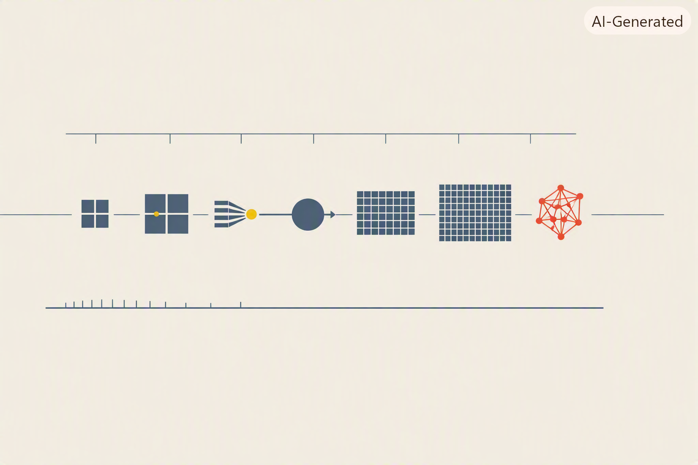

<p align="center">
  
</p>

<p align="center">
  
</p>

*4-Zellen-Block = 4-Bit-CPU ◆ OS-Bloecke = Prozesse ◆ Bahnknoten = Compiler ◆ Neuron = Perceptron ◆ Grids = GPU-Threads ◆ Netz-Web = verbundene Rechner ◆ dieselbe Idee, sechs Skalierungsstufen.*

──────────◆──────────◆──────────◆──────────◆──────────

**Von Bleistift und Papier zu vernetzten Hochleistungsrechnern — sechs Meilensteine, die zeigen, wie aus einer Bürotätigkeit eine weltweite Infrastruktur wurde.**

Alles selbst programmiert, ohne Frameworks. Jede Instruktion, jedes Bit, jedes Bus-Signal ist im Code sichtbar. Und weil moderne KI ohne massive Parallelität nicht existieren würde, gehört dazu auch ein Blick unter die Motorhaube der GPU.

---

## 📜 Warum dieser Teil?

Ein oft vergessener Punkt vorweg: bis in die 1940er Jahre hinein war *„Computer"* im Englischen keine Maschine, sondern ein **Beruf**. Ein Computer war ein Mensch — meistens eine Frau — die den ganzen Tag Zahlen rechnete. Rechen-Ämter mit dutzenden bis hunderten menschlicher Rechner gab es seit dem 18. Jahrhundert: für nautische Ephemeriden, für Napoleons Vermessungsbüro, für die amerikanischen Volkszählungen, für Ballistiktabellen der Artillerie. Die Maschine, die wir heute *Computer* nennen, hat den Beruf nicht neu erfunden — sie hat ihn übernommen.

Was diesen Beruf über zwei Jahrhunderte hinweg vorangetrieben und schließlich in Maschinen überführt hat, waren nicht abstrakte Ideen, sondern **konkrete Notwendigkeiten**: eine Aufgabe wurde für die vorhandene Rechen­kapazität zu groß, jemand suchte den Ausweg, das nächste Werkzeug entstand. Astronomische Ephemeriden für die Schifffahrt. Der US-Zensus, der länger dauerte als der Zensus-Zyklus. Ballistik im Zweiten Weltkrieg. Die Trajektorien für Apollo. Handel und Buchhaltung. Das Internet. Deep Learning. Immer dasselbe Muster: **wer die Not hatte, baute die Maschine.**

Erst wenn man diese Kette sieht, wird klar, warum die Reihenfolge der Kapitel in diesem Buch keine Zufalls-Ordnung ist, sondern eine *Antwortkette*: eine CPU macht einen einzelnen menschlichen Rechner überflüssig. Ein OS erlaubt es, denselben teuren Rechner für mehrere Aufgaben zu nutzen. Ein Compiler erlaubt es, ihn ohne jahrelanges Assembler-Studium zu programmieren. Eine GPU erlaubt es, dieselbe Aufgabe (Matrix-Multiplikation) tausendfach parallel zu rechnen. Ein Netzwerk erlaubt es, die Rechenleistung vieler Maschinen zusammenzuschalten. Und dass in dieser Reihe genau die Bausteine sitzen, die ein modernes KI-Training braucht, ist kein Zufall — es ist die letzte Etappe derselben Not-treibt-Werkzeug-Kette.

Deshalb steht dieser Teil am Anfang eines Buches über KI: **weil KI die aktuelle Antwort auf eine 300 Jahre alte Frage ist.** Und weil man Antworten besser versteht, wenn man die Fragen kennt, die sie beantworten.

Ein pragmatischer Zusatzeffekt: wer versteht, wie CPU, OS, Compiler, GPU und Netzwerk funktionieren, wird bei Fragen wie *„Warum ist mein Training so langsam?"* oder *„Warum verhält sich mein Modell auf einer anderen Maschine anders?"* nicht mehr im Dunkeln tappen. Diese Grundlagen sind, anders als die Modelle aus Teil 2, **zeitlos gültig**: die Ideen, die Hollerith, Zuse, von Neumann, Backus, Ritchie und Kahn/Cerf hatten, funktionieren heute noch genau wie damals.

---

## 🔥 Wer die Not hatte, baute die Maschine

Ein knapper Überblick über die Bedarfstreiber, die aus einer Bürotätigkeit über 300 Jahre eine weltweite Infrastruktur gemacht haben:

| Zeitraum | Bedarfstreiber | Antwort |
|----------|----------------|---------|
| **1767–1830** | Nautische Ephemeriden, Napoleons Vermessungsbüro (de Prony) | „Computers" als **Beruf**: bis zu 90 menschliche Rechner im Fließband-Verfahren |
| **1880–1890** | US-Zensus: Auswertung von 1880 dauert 7 Jahre, 1890 droht zu überlaufen | Herman **Holleriths Tabulating Machine** — mechanische Datenverarbeitung, Grundstein von IBM |
| **1935–1941** | Statik-Berechnungen, sich wiederholende ingenieurwissenschaftliche Aufgaben | **Konrad Zuse Z1–Z3** — der erste frei programmierbare Rechner, in einer Berliner Wohnung |
| **1943–1946** | Bletchley Park (Codebrechen), Los Alamos (Manhattan-Projekt), US-Ballistik | **Colossus, ENIAC** — die ersten elektronischen Groß-Rechner, gebaut aus reiner Kriegs-Not |
| **1957–1972** | Kalter Krieg, Wettlauf zum Mond, Apollo-Trajektorien | **IBM 7090, Systemsoftware**, die berühmten NASA-„human computers" (Katherine Johnson u.a.) werden schrittweise durch Mainframes ersetzt |
| **1960–1980** | Massenverwaltung: Banken, Versicherungen, Behörden | **COBOL, Mainframes**, Datenbanken — der Computer wird zum Büro-Werkzeug |
| **1990–2010** | Internet, E-Commerce, globale Kommunikation | **Server-Farmen, TCP/IP-basierte Cloud-Architekturen** |
| **2012 ff.** | Deep Learning, Sprachmodelle — Aufgaben, die selbst 2010er-Server nicht schultern | **GPU-Cluster** (10⁴ Karten für GPT-3), spezielle KI-Beschleuniger (TPU, Trainium) |

Zwei Beobachtungen aus dieser Tabelle:

- **Die Maschine folgt der Not, nicht umgekehrt.** Niemand hat einen Computer gebaut, weil es „interessant" wäre — die Aufgaben waren jeweils schon da und wurden untragbar. Der Computer ist eine Antwort, nicht ein Vorschlag.
- **Jede Ära hat ihren eigenen Bedarfstreiber**, und der bestimmt, welche Art Maschine entsteht: kriegerische Not führt zu ENIAC (schnell, teuer, spezialisiert), Verwaltungs-Not zu COBOL-Mainframes (langlebig, robust, business-lesbar), KI-Not zu GPU-Clustern (massiv parallel, spezialisiert, teuer). Die Grund­struktur (von Neumann: Speicher, ALU, Kontrolle) bleibt in jeder Ära dieselbe. Das *Warum* ändert sich; das *Wie* skaliert.


## 🕰️ Historischer Bogen

| Jahr | Ereignis | Kapitel |
|------|----------|---------|
| **1945** | Von Neumann — Architektur mit Speicher, ALU, Kontrolleinheit | **1. CPU** |
| **1947** | Erste Transistoren bei Bell Labs (Bardeen, Brattain, Shockley) | |
| **1948** | Kilburn / Manchester — erstes speicherprogrammiertes System | |
| **1955** | GM-NAA I/O — erstes echtes Batch-Betriebssystem | **2. OS** |
| **1957** | Backus (IBM) — FORTRAN, erster erfolgreicher Compiler | **3. Compiler** |
| **1958** | McCarthy (MIT) — LISP | |
| **1959** | Hopper et al. — COBOL, natürlichsprachliche Programmierung | |
| **1961** | Atlas Supervisor — erstes OS mit virtuellem Speicher | |
| **1969** | Ritchie & Thompson — Unix | |
| **1969** | ARPANET | **6. Network** |
| **1972** | Ritchie — C, „portables Assembler" | |
| **1974** | Kahn & Cerf — TCP/IP | |
| **1983** | ARPANET wird zum Internet | |
| **2001** | GeForce 3 — erste programmierbare Shader | **5. GPU** |
| **2004** | Buck et al. — BrookGPU (Stanford), Beginn von GPGPU | |
| **2006** | NVIDIA — CUDA 1.0 | |
| **2012** | AlexNet auf zwei GTX 580 — die GPU wird zum KI-Rechenwerk | |
| **2017** | NVIDIA Volta — Tensor Cores, GPU passt sich der KI an | |

**Zwei Beobachtungen aus dieser Tabelle**, die durch die ganze Reihe tragen:

- Vier der fünf klassischen Bausteine — **CPU, OS, Compiler, Netzwerk** — wurden zwischen 1945 und 1974 erfunden, in weniger als 30 Jahren. Die 50 Jahre danach waren im Kern *Skalierung* dieser Ideen, nicht ihre Ablösung. Genau das ist die These, die dieses Buch immer wieder aufgreift.
- Die einzige *neue* Klasse von Rechen­hardware, die für unser Thema in diesen 50 Jahren dazukam, ist die **GPU** — und auch sie ist im Kern kein Bruch mit dem Von-Neumann-Prinzip, sondern ein bewusster Kompromiss (sehr viele einfache Kerne statt weniger komplexer). Sie entstand aus einem Nebenmarkt (Videospiele) und wurde von Deep Learning erst *nachträglich* gefunden — nicht bestellt.

---

## 🧭 Die sechs Meilensteine

### [`01_CPU/`](01_CPU/README.md) — Eine 4-Bit-CPU von Hand

**Kern:** Ein simulierter Prozessor mit den fünf Bausteinen jeder Von-Neumann-Maschine — **Programmzähler**, **Register**, **ALU**, **Bus**, **Kontrolleinheit mit Mikrocode-ROM**. Programme sind in einer eigenen Assembler-Sprache mit 16 Opcodes geschrieben. Die Simulation läuft in einem Terminal-UI: man kann live zusehen, wie ein Programm Instruktion für Instruktion ausgeführt wird — welche Bus-Signale gerade aktiv sind, welche Werte in den Registern stehen, welcher Mikrocode-Eintrag gerade den Bus ansteuert.

**Wow-Moment:** Man sieht, wie aus einer einzigen Instruktion `ADD` in Wirklichkeit *drei* parallele Bus-Aktivitäten werden (`ALU_OUT`, `AX_IN`, `ALU_ADD`). Der Trick heißt Mikrocode, und er ist bis heute die Grundlage jeder CPU-Firmware.

### [`02_OS/`](02_OS/README.md) — Ein Mini-Betriebssystem

**Kern:** Zwei verschiedene OS-Modelle auf derselben CPU-Basis:

- **Weg 1** — ein *kooperatives Multitasking-OS* mit **Segment-Register** und **YIELD**-Opcode. Zwei Prozesse laufen quasi-gleichzeitig, jeder in seinem eigenen RAM-Segment, das OS macht Context-Switches bei jedem YIELD. Nachbau von Mac OS Classic / Windows 3.x.

- **Weg 2** — ein *Batch-OS, das selbst ein Assembler-Programm ist* (im 4-Bit-Instruktionssatz der CPU). Es liegt bei `BP=0` im Programmspeicher, wird beim Boot ausgeführt, ruft User-Jobs nacheinander auf und bekommt via `HLT`-Trap die Kontrolle zurück. **10 Instruktionen** OS-Code, mehr braucht es nicht. Nachbau von GM-NAA I/O (1955).

**Wow-Moment:** Bei Weg 2 sieht man, wie ein „böser" User-Job durch einfaches Überschreiben einer RAM-Zelle den Scheduler manipulieren kann — genau die Unsicherheit, die zur Erfindung von MMUs und Speicherschutz führte.

### [`03_Compiler/`](03_Compiler/README.md) — Vier Sprachen, ein Assembler

**Kern:** Vier Frontends (COBOL, FORTRAN, C, LISP), jedes mit eigener Grammatik und Boilerplate — von 5 Zeilen LISP bis 18 Zeilen COBOL. Alle produzieren denselben internen **AST** (Abstract Syntax Tree), aus dem ein gemeinsamer Codegenerator identischen Assembler-Code für die CPU aus Kapitel 1 erzeugt. Der Assembler läuft dann auf dem Simulator, und das Ergebnis-Register OUT enthält am Ende die berechnete Zahl.

**Wow-Moment:** Die Rechnung `(3 + 4) - 1 = 6` — in vier Sprachen geschrieben, kompiliert zu bit-identischen 13 Assembler-Instruktionen (nur COBOL braucht 2 mehr, weil `ADD ... GIVING` das Zwischenergebnis nach RAM zwingt). Die Botschaft: **Sprache ist reine Ergonomie. Die Maschine sieht immer nur die 16 Opcodes.**

### [`04_PerceptronOnCPU/`](04_PerceptronOnCPU/README.md) — Das erste Perceptron als Assembler-Programm

**Kern:** Rosenblatts Perceptron (1958) — ein einzelnes künstliches Neuron mit zwei Eingängen — in **16 Instruktionen** auf unserer 4-Bit-CPU. Wir erweitern die CPU um zwei neue Opcodes (`MUL` für die Gewichtungen, `JN` für „Jump if Negative" beim Schwellwert-Vergleich). Das Programm klassifiziert AND, OR, NAND perfekt. Beim vierten Test — XOR — findet auch eine erschöpfende Brute-Force-Suche über 512 Gewichts-Kombinationen keinen Satz, der alle 4 Fälle richtig klassifiziert.

**Wow-Moment:** Der Vergleich der drei Tabellen (AND/OR/NAND jeweils 4/4, XOR maximal 3/4) — und damit das empirische Wiedersehen von Minsky/Papert 1969. Der erste KI-Winter beginnt genau hier, an dieser einen 16-Instruktions-Grenze.

Dieses Kapitel ist die **Brücke zu Teil 2**: es zeigt, dass ein neuronales Netz aus Sicht der CPU nur ein sehr kurzes Programm ist. GPT ist Milliarden mal komplexer, aber die Grundoperation `w·x + b` läuft genau so. Aber es zeigt auch die Grenze: schon ein MLP auf MNIST würde diese CPU Tage rechnen lassen. Was fehlt, ist massive Parallelität — und die kam historisch aus einer ganz anderen Richtung: der Grafikkarte.

### [`05_GPU/`](05_GPU/README.md) — Vom Grafikbeschleuniger zum KI-Rechenwerk

**Kern:** Die Geschichte, wie eine für Videospiele gebaute Hardware zum wichtigsten Bauteil moderner KI wurde. Wir gehen den Weg **Fixed-Function-Grafik (1996) → programmierbare Shader (2001) → GPGPU-Forschung / BrookGPU (2004) → CUDA (2006) → AlexNet auf zwei GTX 580 (2012)** durch und zeigen an einem eigenen kleinen **SIMT-Simulator** in Python, warum eine GPU für Matrix-Multiplikation um Größenordnungen schneller ist als eine CPU — obwohl beide Turing-vollständig sind und im Kern dasselbe rechnen.

**Wow-Moment:** Der Sprung *„Pixel-Shader → Matrix-Kernel → MLP-Layer"* ist begrifflich winzig — dieselbe Struktur „viele Threads, dasselbe Programm, verschiedene Daten". Deep Learning hat die GPU **nicht bestellt, sondern gefunden**: die Hardware war schon da, aus Gründen des Spielemarktes. Der zweite KI-Winter endete zu einem Gutteil deshalb, weil zufällig eine passende Rechen-Hardware für ~1000 $ verfügbar geworden war.

Dieses Kapitel ist die **zweite Brücke zu Teil 2 und 3**: es erklärt, warum Backpropagation (1986) für die eigentliche Deep-Learning-Welle **26 Jahre** warten musste, und warum jedes GPT auf tausenden GPUs trainiert wird.

### [`06_Networks/`](06_Networks/README.md) — Das Netzwerk: ALOHA

**Kern:** Wir bauen den ALOHA-Simulator (Norman Abramson, Hawaii 1970) — das erste funktionierende Paket-Random-Access-Protokoll und Ur-Ahn von Ethernet und WLAN. Ein Kanal, viele Sender, keine Absprache: „sende, wenn du willst; bei Kollision zufällig warten und erneut senden". In `src/aloha.py` steckt die vollständige Simulation für Pure ALOHA und Slotted ALOHA, mitsamt geschlossenen Theoriekurven $S = G e^{-2G}$ bzw. $S = G e^{-G}$.

**Wow-Moment:** Der **Kollaps-Effekt**. Für kleines $G$ steigt der Durchsatz. Bei $G=0{,}5$ (Pure) bzw. $G=1{,}0$ (Slotted) erreicht er sein Maximum — **18,4 %** bzw. **36,8 %**. Danach *sinkt* er wieder. Ein Kanal, der zu 100 % gefüllt wird, liefert weniger als einer, der zu 37 % gefüllt wird. Das ist genau die Kollisions-Rückkopplung, die auch bei TCP-Congestion oder Web-Servern unter Last auftritt — beobachtbar in einem 200-Zeilen-Python-Skript.

**Bogen zu Teil 2:** Hier endet die klassische *Wie-funktioniert-ein-Computer*-Frage. Wir können Rechner bauen, Programme kompilieren, Aufgaben parallelisieren und Bytes übertragen — aber kein einziges der übertragenen Bytes „weiß", ob es eine Frage, eine Antwort oder ein Wörterbucheintrag ist. Um Text zu *verstehen* statt nur zu *übertragen*, brauchen wir eine ganz andere Klasse von Programmen: Programme, die *trainiert* werden statt *ausgeführt*. Damit beginnt Teil 2.

---

## 🧭 Der rote Faden

Jedes Kapitel behebt eine Grenze des vorherigen:

> **CPU allein**: Ein Programm läuft, aber wie kommen mehrere Programme auf denselben Rechner? → **OS**  
> **OS + CPU**: Programme laufen, aber wie schreibt man sie in einer Sprache, die einen Menschen nicht verrückt macht? → **Compiler**  
> **Compiler + OS + CPU**: Ein einzelnes Perceptron passt in 16 Instruktionen — aber ein MLP nicht mehr in vertretbare Zeit → **GPU**  
> **CPU + GPU**: Eine Maschine reicht, um ein kleines Netz zu trainieren, aber nicht ein GPT-3 mit 175 Milliarden Parametern → **Netzwerk**

Am Ende dieses Teils hast du **die sechs zeitlosen Bausteine moderner Rechen­technik** einmal selbst gebaut — von der 4-Bit-CPU bis zum SIMT-Modell heutiger KI-Beschleuniger. Damit kannst du dann fundiert nach `02_MachineIntelligence/` wechseln, in dem wir aus diesem Fundament heraus lernende Maschinen bauen.

---

## 🚀 Schnelleinstieg

```bash
cd 01_Computing

# Kapitel 1: CPU-Simulator (Live-UI)
python 01_CPU/src/main.py

# Kapitel 2, Weg 1: Kooperatives Multitasking mit YIELD
python 02_OS/src/os_sim.py

# Kapitel 2, Weg 2: Batch-OS, das selbst ein Assembler-Programm ist
python 02_OS/src/os_batch.py

# Kapitel 3: Compiler-Test — vier Sprachen, ein Assembler
python 03_Compiler/test_compiler.py

# Einzelnes Beispiel kompilieren:
cd 03_Compiler
python -m src.compile examples/arith.c --run
```

Alle Programme laufen mit **Python 3.7+** ohne externe Abhängigkeiten. Für die Terminal-UI benötigt man ein ANSI-fähiges Terminal (Windows Terminal, iTerm, Linux-Konsole).

---

## 🧠 Was dieser Teil bewusst nicht zeigt

- **Digitale Logik unterhalb der CPU** — wir setzen bei der Ebene „Bus, Register, ALU" ein, nicht bei Transistoren, Gattern, Flipflops. Das wäre ein eigener Meilenstein wert (z.B. ein NAND-Gate-Simulator, aus dem sich alles andere aufbauen lässt), aber er würde den Rahmen sprengen.
- **Moderne CPU-Techniken** — Pipelining, Out-of-Order-Execution, Cache-Hierarchien, Branch Prediction, Vector-Instruktionen, Multicore. Alles wichtig, alles gehört auf eine reale CPU, aber didaktisch würde es die Ideen unter Details begraben.
- **Vollständige Sprachen** — der Compiler in Kapitel 3 unterstützt nur einen winzigen Ausschnitt jeder Sprache. Er zeigt das *Prinzip*, nicht die Realität eines GCC oder LLVM.
- **Echtes CUDA / echte GPU-Ausführung** — Kapitel 5 simuliert das SIMT-Modell in Python. Die Threads laufen softwareseitig nacheinander, wir zählen aber die *Schritte*, als liefen sie parallel. Auf einer echten NVIDIA-GPU wären es Millisekunden statt Sekunden — die *Ideen* (Kernel, Threads, Warp Divergence, Speicherbandbreite) sind aber identisch.

Wenn du diese Beschränkungen für zu eng hältst, ist das genau der Punkt, an dem du bereit bist, dich mit den originalen Standards zu befassen — was dann viel einfacher fällt, wenn die Grundstruktur schon steht.

---

## 📚 Referenzen

**Zur Vorgeschichte — als „Computer" noch ein Beruf war:**

- Grier, D. A. (2005). *When Computers Were Human*. Princeton University Press. Die maßgebliche Studie zur Menschen-Computer-Ära von den 1750ern bis zu den 1940ern. Zeigt, wie de Prony, Maskelyne, das Nautical Almanac Office und das WPA Mathematical Tables Project funktionierten.
- Sobel, D. (1995). *Longitude*. Walker Books. John Harrison, der Längengrad, und die Not, die Ephemeriden und schließlich Rechen-Ämter für die Schifffahrt notwendig machte.
- Shetterly, M. L. (2016). *Hidden Figures: The American Dream and the Untold Story of the Black Women Mathematicians Who Helped Win the Space Race*. William Morrow. Die menschlichen „computers" der NACA/NASA, u.a. Katherine Johnson, die die Apollo-Trajektorien rechnete.
- Aspray, W. (1990). *Computing Before Computers*. Iowa State University Press. Sammelband zur mechanischen Rechen­geschichte vor Zuse: Pascaline, Leibniz, Babbage, Hollerith.

**Zum modernen Computer:**

- Petzold, C. (2000). *Code: The Hidden Language of Computer Hardware and Software*. Microsoft Press. Der Klassiker: vom Morsezeichen zum Computer, ganz ohne Vorwissen.
- Nisan, S., & Schocken, S. (2008). *The Elements of Computing Systems* — auch bekannt als „nand2tetris". Vom NAND-Gatter über CPU und Compiler bis zum Betriebssystem, alles selbst gebaut. Direkte Inspiration für diesen Teil.
- Patterson, D., & Hennessy, J. (2020). *Computer Organization and Design* (6th ed.). Der Standard-Lehrtext zur Rechnerarchitektur.
- Silberschatz, A., Galvin, P., & Gagne, G. (2018). *Operating System Concepts* (10th ed.). Standard-Referenz für OS.
- Aho, A. V., Lam, M. S., Sethi, R., & Ullman, J. D. (2007). *Compilers: Principles, Techniques, and Tools* (2nd ed.). Der „Dragon Book".
- Kurose, J., & Ross, K. (2020). *Computer Networking: A Top-Down Approach* (8th ed.). Standard-Text für Netzwerke.
- Tanenbaum, A. S. (2015). *Modern Operating Systems* (4th ed.). Pearson.
- Buck, I., et al. (2004). *Brook for GPUs: Stream Computing on Graphics Hardware*. ACM SIGGRAPH. Das Paper, das die GPGPU-Ära einläutet.
- Nickolls, J., Buck, I., Garland, M., & Skadron, K. (2008). *Scalable Parallel Programming with CUDA*. ACM Queue, 6(2). Die kanonische Einführung in CUDA.
